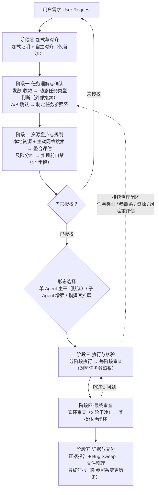

<div align="center">


# GPT系列推理风格 · GPT-Series Reasoning Style

**把"Agent 说做完了"变成"Agent 证明做完了"。**
**Turn "the agent says it's done" into "the agent proves it's done".**

一个面向 AI Agent 的**交付纪律行为层**（behavior overlay）——
实现前门禁、资源盘点、任务类型自适应、多 Agent 协作治理、证据核验与实操验收。

[](#versioning--版本)
[](#license--许可证)
[](#install--安装)
[](#tooling--工具链)
[](https://github.com/JadeYingWah/gpt-series-reasoning-style/actions)
[](#tooling--工具链)
[](#tooling--工具链)

</div>

> **Process-discipline layer only** — not a reasoning-capability booster and not GPT-specific —
> the name records its origin (distilled from a long series of GPT-series model dialogues).
>
> 本 skill 是**纯流程纪律层**：不提升模型推理能力，也不绑定 GPT 系列——名字记录的是它的来源
> （从一系列 GPT 系列大模型的真实对话中打磨提炼）。中文主导、分层双语（见 [Language Policy](#language-policy--语言策略)）。

---

## Quick Start / 快速开始

```bash
# 1. 安装（以 Claude Code 为例；其余 12 个平台见 Install 节）
git clone https://github.com/JadeYingWah/gpt-series-reasoning-style
cd gpt-series-reasoning-style
./scripts/install.sh claude            # Windows: .\scripts\install.ps1 -Platform claude

# 2. 在对话里按名调用
#    使用 gpt-series-reasoning-style 执行本次任务。
```

**Claude Code 免 clone 一键装（插件市场）**：在 Claude Code 里执行 `/plugin marketplace add JadeYingWah/gpt-series-reasoning-style`，再 `/plugin install gpt-series-reasoning-style@gpt-series-reasoning-style`（或直接在 `/plugin` 菜单里安装；钉大版本可在 add 时加 `@v1.2.0`）。其余平台与手动方式见 [Install](#install--安装)。

加载后，AI 在动手建文件 / 写代码 / 跑命令之前，会先停下给你一张确认单；声称"做完了"时必须附上可核对的证据。

**只想要核心、不想装整套？** 把 [Minimal Usage](#minimal-usage--最小用法) 的三条规则贴进宿主配置即可（官方 **Lite 档**，实测 147 tokens）。

---

## 目录 / Table of Contents

- [Quick Start / 快速开始](#quick-start--快速开始)
- [Why / 为什么需要它](#why--为什么需要它)
- [What It Is / 这是什么](#what-it-is--这是什么)
- [How It Works / 工作原理](#how-it-works--工作原理)
- [Honesty & Evidence / 诚实与证据](#honesty--evidence--诚实与证据)
- [Collaboration & Multi-Agent / 协作与多 Agent](#collaboration--multi-agent--协作与多-agent)
- [Field Tests & Evidence / 实测与证据](#field-tests--evidence--实测与证据)
- [Cost / 成本](#cost--成本)
- [When To Use / 何时使用](#when-to-use--何时使用)
- [Install / 安装](#install--安装)
- [Minimal Usage / 最小用法](#minimal-usage--最小用法)
- [Repository Layout / 仓库结构](#repository-layout--仓库结构)
- [Tooling / 工具链](#tooling--工具链)
- [Language Policy / 语言策略](#language-policy--语言策略)
- [Complexity Budget / 复杂度预算](#complexity-budget--复杂度预算)
- [Versioning / 版本](#versioning--版本)
- [Maintainer Notes / 维护者笔记](#maintainer-notes--维护者笔记)
- [License / 许可证](#license--许可证)

---

## Why / 为什么需要它

**生态定位**：截至 2026 年中，Agent Skills 生态已有 120 万+ 技能包（Anthropic 2025-10 发起、2025-12 成为跨厂商开放标准，OpenAI Codex / Microsoft Copilot 全部跟进）。但**绝大多数是能力型**（教 AI 做具体事：写前端、做财务、调 API），**质量纪律层是生态空白**——能找到的同类只有零散的"验证声明"模板和六专家审查工具，没有一个有系统性 A/B 实验背书的执行纪律层。本 skill 填补的就是这个空白。

AI 协作里最贵的两类失败，都不是"模型不够聪明"：

1. **未授权就动手**——AI 宣布了一串"接下来我要做什么"，然后直接建目录、写文件、跑命令；
2. **声称未验证的完成**——"已经修好了 / 测试都过了"，而磁盘上没有可核对的证据，甚至根本没跑过。

一次"假完成"的返工成本（澄清 + AI 重读上下文 + 重做）通常在 2 万–10 万 token；本 skill 的常驻面开销约 9.8k token（详见 [Cost](#cost--成本)）。**它把防假完成做成第一优先级，正是因为那是 token 账上最贵的一项。**

它带来的改变，一眼可见：

```text
【没有纪律】                    【有本 skill】
用户：帮我做个登录页             用户：帮我做个登录页
AI  ：好的，我开始建文件……       AI  ：【实现前确认】
      （直接动手）                     - 目标 / 任务类型 / 风险分档 / 形态
                                      - 已盘点资源 / 推荐方案
                                      - 需要你确认：……
                                   （停下，等授权）

AI  ：做完了，测试都过了。        AI  ：完成。附磁盘自检清单：
      （无证据）                       - 改动文件 + 关键 diff
                                      - 测试 RED→GREEN 输出
                                      - 浏览器实测截图
                                      - 按钮交互我点不了：UNVERIFIED
```

---

## What It Is / 这是什么

### 定位与名称 / Positioning & Name

这是一层可以装进任何 Agent 宿主的行为纪律。它是一个普通 Agent Skills 包：常驻面只有 `SKILL.md` + `VERSION`（实测约 9.8k tokens，o200k_base），
15 份 references 按需取节加载，`AGENTS.md` 为 Codex / Gemini CLI / Copilot CLI 等运行时提供跨运行时入口别名。

- **名字记录来源，不划能力边界**：规则纪律从一系列 GPT 系列大模型的真实对话记录中打磨提炼，公开发布线为 1.0.0 → 1.1.0 → **1.2.2**（更早的内部迭代已归档于 [`INTERNAL-HISTORY.md`](INTERNAL-HISTORY.md)）。
- **不依赖、也不限于 GPT 系列**：任何宿主模型（Claude / Gemini / DeepSeek / Qwen / GLM …）均可加载使用。
- **`reasoning-style` 指"推理的流程纪律风格"，不是推理能力上限**：它约束 AI 怎么干活（先理解、先盘点、先门禁、给证据），不会让模型变得更聪明。
- **曾用名 / Formerly**：`gpt-5-6-sol-multi-agent-style`（"GPT-5.6 Sol"，内部期），旧检索别名 `gpt-5-6-sol-reasoning-style`——供搜索引擎与联网 AI 把旧名归并到本仓库。

### 关键数字速览 / Key Numbers at a Glance

> 以下为当前版本（v1.2.5）的权威数字，所有跨文件一致性由 `scripts/selfcheck.py`（SB1–SB23）自动校验。

| 维度 | 数字 | 说明 |
|---|---|---|
| 当前版本 | **v1.2.5** | `VERSION` 文件唯一权威 |
| SKILL.md | **178 行 / 约 9.8k tokens** | 常驻面，o200k_base 分词器实测 |
| References | **15 份** | 按需取节加载，非整读 |
| 内置角色身份 | **21 个** | `identities/` 目录（另含 README + _template，共 23 个 .md 文件） |
| 行为自测 | **77 条** | `references/self-test.md`，v1.1.0 扩容后冻结 |
| 静态自检 | **23 项** | SB1–SB23，CI 每次 push 自动跑 |
| 实现前门禁 | **14 字段** | v1.2.2 A2+ 第五增强点升级（旧版 10 字段已淘汰） |
| 指挥官任务包 | **23 字段** | 跨模型协作协议 |
| CI 流水线 | **14 步** | Python 3.9，严格退出码 |

### 核心机制 / Core Mechanisms

| # | 机制 | 一句话 |
| --- | --- | --- |
| 1 | **加载证明 / Load Proof** | 证明已加载只需 `SKILL.md` + `VERSION`：输出版本号、逐字引用门禁硬规则第一条、协作架构简介、实际读过的文件清单。读不到就请求权限，**不伪造**。 |
| 2 | **实现前门禁 / Pre-Implementation Gate** | 建目录、写文件、跑实现命令之前，先输出 14 字段确认单（含任务类型、任务参照系摘要）并停止。门禁只挂四类风险操作。 |
| 3 | **轻量通道 / Light Channel** | 具体、影响小、完全可逆、无副作用的任务，指令本身即授权——直接做，做完仍报实际改动与证据。三条排除项防钻空子。 |
| 4 | **资源盘点 + 资产编排 / Resource Survey & Orchestration** | 动手前盘点一切可用资源（本地 skills + 主动网络搜索，必做）；每个选用的 skill 须说明解决哪个子问题、为什么是它、输出如何验证；未使用的资源须说明原因。 |
| 5 | **三层结构 / Three-Layer Architecture** | **静态核心**（原则、底线、门禁、证据要求，不轻易变）· **动态适配**（任务类型、风险、资源、严格度，持续重评估）· **模块化选择**（按规模匹配默认配置，有理由才偏离）。 |
| 6 | **任务类型自适应 / Task-Type Adaptation** | 类型判断必须基于网络搜索、不靠内部静态分类，且不是一次性锁死——执行中每阶段重评估，类型变化自动调整严格度。创意类最松、代码/数据类最严、混合类分治。 |
| 7 | **任务参照系 / Task Constitution** | 每个任务的"宪法"（目标精确定义、质量标准、严格度、关键决策点、变更记录），执行中逐阶段对照更新，最终汇报附变更历史——防执行漂移。 |
| 8 | **证据纪律 + 通过率不是鉴别力 / Evidence & Discrimination** | 证据强于信心；未验证一律标 `UNVERIFIED`；任何"N/N 全过"声明必须能回答"把要防的错误做一次会不会红"。 |
| 9 | **实操验收 / Hands-On Acceptance** | 交互类产物必须亲手操作每个按钮、按键、手势并截图留证；没操作过的标 `UNVERIFIED`。 |
| 10 | **持续治理闭环 / Continuous Governance** | 盘点、分档、门禁、验收、任务类型、参照系不是做完就归档——执行中变化时须重评估并记录；声明了但未应用＝形式执行。 |
| 11 | **DRI 与收口 / Ownership** | 用户是最终决策者；委派之后总指挥仍是 DRI（最终收口负责人）；一任务一 DRI。 |

此外四条贯穿性原则：

- **创意任务防的是平庸，不是返工**：门禁锁定范围与落盘，不锁定方向；大胆是默认，保守才需要理由。创意主导任务须并列 2–3 个真实不同方向，完全可逆的本地产物可免方向确认直接起跑。简化或砍掉已计划能力须**先声明**并列「简化项清单」——「从简」不是免检通行证。
- **产物优先，流程为产物服务**：加载证明、对齐声明、门禁单等仪式性输出保持最小篇幅；禁止用流程合规顶替实质工作——交付物的正确性/完整性/深度是第一质量维度。
- **范围克制**：完成用户目标所需的改动主动处理；发现的无关问题只记录报告，不扩大重构。**与验收目标直接相关的缺陷不属于"无关问题"**，必须主动修复或显式提请裁决。
- **让位原则**：本 skill 只规范流程、不主导内容——其他 skill 或宿主能力对内容/风格/创意有主张时让位配合；但诚实（证据/UNVERIFIED）、安全防护、真实环境验收是最后防线，任何优先级下不失效。

### 边界 / What It Is Not

| 它不是 | 说明 |
| --- | --- |
| ❌ 推理能力增强器 | 纯流程纪律层；宿主据此判定挂载，避免"提升推理"类请求误触发（`agents/openai.yaml` 亦声明 `allow_implicit_invocation: false`）。 |
| ❌ GPT 专用 | 名字只记录来源；规则与模型无关。 |
| ❌ 身份替换 | 行为叠加层（behavior overlay）：宿主 Agent 的身份与平台规则永远优先。 |
| ❌ 常驻上下文包装 | 仅按需**显式按名调用**；琐碎任务走轻通道直接做。可选的单行 SessionStart hook 只是对"遗忘"的对冲（见 [Install](#install--安装)）。 |
| ❌ 宿主能力的重复叠加 | 宿主已自带同等规划/审查/验收时，优先用宿主原生流程；首次使用先做**宿主对齐声明**，被完整覆盖的小节标 SKIP。 |
| ❌ 全自动质量保证 | 机器只做机器能诚实做的事：结构检查、fresh 复跑、计数留痕；**判卷的是人**——自测判定、探针判分、内容真实性永远由人核证据。 |

**宿主对齐（Host Alignment，仅首次、仅一次、不阻塞）**：加载证明之后、首次门禁之前，AI 输出一次对齐声明——①宿主已有能力清单（规划/二次确认/审查门禁/验收流程，逐项）②与本 skill 的重叠映射（被宿主完整覆盖的小节标 SKIP）③裁剪后的使用范围。声明输出即生效，默认不等待确认；未证实的能力按保守假设处理并标 `UNVERIFIED`；可落盘 `<项目根>/docs/agents/host-alignment.md` 复用。AI 不得为适配而修改 skill 本体。**三条底线永不可被对齐跳过：证据报告、`UNVERIFIED` 诚实标记、真实环境验收。**

---

## How It Works / 工作原理

> 完整 870+ 行流程（含授权矩阵、发散-收敛协议、审计模板）见 [`references/series-reasoning-workflow.md`](references/series-reasoning-workflow.md)（中文权威版，头部有 Section Map，按节取用，**勿整读**）；英文镜像为 [`-en.md`](references/series-reasoning-workflow-en.md)（中文宿主勿读）。流程图对照 [`master-process-reference.md`](references/master-process-reference.md)（主过程参照系，设计原点）绘制。



### 阶段一：理解、判断与门禁

**动态任务类型判断 + A/B 确认 + 制定任务参照系**：先主动网络搜索该任务领域的最新分类、行业标准、最佳实践和类似案例，再基于搜索结果判断初始类型（创意/代码/绘画/建模/数据/冒险/混合），按类型确定流程严格度；然后用 A（一次性确认推荐方案）/ B（逐项问答，一次只问一个最高影响问题，每题给 2–3 个实质方案+推荐+自由出口）与用户确认；确认后制定本任务的**参照系（Task Constitution）**——目标精确定义、类型及判断依据、可检查的质量标准、流程严格度、关键决策点、变更记录。参照系不是一次性锁死，每阶段审查时对照检查并更新，更新必须记录原因，最终汇报附变更历史。

**实现前门禁（动手前先过 14 字段门禁）**：在创建项目目录、编辑文件或运行实现命令之前，先输出 14 字段确认单并停止。14 个字段为：我理解的目标 / 任务类型（含搜索依据+参照系摘要）/ 风险分档 / 形态选择 / 已盘点可用资源（含资源使用计划）/ 最高影响问题 / 推荐方案 / 其他选项 / 完整计划 / 澄清方式 / 需要你确认 / 确认范围 / 声明持续有效条件 / 完成标准与失败行为。完整模板见 `SKILL.md` 与 workflow 权威版。

**硬性规则**：

- 宣布阶段序列不是确认。
- "开始""现在开始""直接做"不是实现授权；"你决定""按最高质量方案做"是显式委托，记录决定后再继续。
- 未盘点可用资源就输出计划，视为计划不完整。
- 用户确认前不创建目录、不写文件、不运行实现命令。

**门禁挂点（确认门禁看风险操作，不看任务受理）**：确认门禁只适用于**破坏性操作、外部执行/发布、不可逆动作、多代理派发**四类风险操作；任务受理、宿主对齐、轻通道修改不触发口头请示。宿主已具备机器级权限兜底（写文件/运行命令授权确认）时，中档任务的门禁降级为**事前一行声明（目标、风险分档、资源摘要、完成标准）+ 事后证据报告**，不再停止等待口头确认；四类风险操作与重档仍须事前确认。

**轻量任务通道**：任务指令具体明确、影响面小（单文件小改、格式/错字修正、纯问答）、完全可逆、无破坏性与外部副作用时，**该指令本身即为授权**，可跳过门禁与资源盘点直接执行，执行后仍须报告实际改动与证据。**三条排除项（命中即升中档全流程）**：①从零新建产物默认中档——除非指令已完整指定产物类型、位置与形态；②多交付物（≥2 个独立产物）；③并行信号（"同时/并行/一起做"）。含糊指令需先澄清再分档；拿不准自动升中档。分档不限于轻/中/重，可自定义中间档（如"轻偏中"）但须声明理由。

**创意/审美主导任务的分档与方向豁免**：风险分档的判据是不可逆性、影响面、副作用——审美方向的大胆不是风险。完全可逆、本地、无副作用的创意产物，仍走中档全流程（落盘路径与范围仍须确认），但允许跳过方向确认、直接选最大胆的自认方案起跑，并在证据报告标注「本次方向为冒险直选」。

### 阶段二：按规模与类型分档执行

**模块化选择矩阵（流程解耦）**——不是所有任务都需要全流程，按任务规模匹配默认配置，有明确理由才偏离；选择结果在门禁中声明，执行中变复杂自动升级并记录。**三条底线任何规模都不可跳过**：诚实标记（UNVERIFIED）、证据报告（含可复现验证命令）、真实环境验收。

| 任务规模 | 判定标准 | 必选模块（不可跳过） | 默认精简（可跳过） |
|---|---|---|---|
| **轻量（验证聚焦版）** | 单文件 / <50行 / 一次性脚本 / 简单查询 / 纯文本改写 | 加载证明、**精简门禁(5字段)**、**核心验证(按任务类型必选)**、**1轮审查(必须含验证)**、证据报告(精简版)、诚实标记 | 任务参照系(改为一句话目标声明)、完整资源盘点(改为一句话摘要)、循环审查(2轮→1轮)、实操闭环(无GUI标UNVERIFIED)、宿主对齐(首次可跳过) |
| **轻量+（A2+，验证深度增强版）** | 中等复杂度 / 需要高可信度 / 开放方法任务 / GUI交互任务 | 轻量全部必选 + **多路径交叉验证** + **验证证据入交付物(evidence/目录)** + **质量标准可检查化** + **保守度调节** + **覆盖面枚举强制前置** | 同轻量 |
| **中等** | 多文件 / 有用户的产物 / 需维护 / 有交互界面 / 涉及API调用 | 核心 + 任务类型判断 + 分阶段执行 + 循环审查(2轮) + 证据报告 | 网络搜索可减深度(1次而非多次)、实操闭环无GUI时标UNVERIFIED |
| **重型** | 大型项目 / 多Agent协作 / 生产级 / 高风险 / 涉及安全 | 全流程（无精简） | 无 |

**轻量配置核心原则：精简≠省略验证，而是聚焦最关键的验证。** 轻量任务必须保留按任务类型的核心验证（数据类→Python独立计算、代码类→语法+边界测试、视觉类→对比度计算、建模类→OBJ语法检查、冒险类→结局可达性检查、研究类→来源核查）。

**轻量+（A2+）五个增强点**：①**多路径交叉验证**——核心结论至少用 2 种独立方法验证（统计+领域知识、Python计算+公式推导、主实现+变异测试）；②**验证证据必须入交付物**——所有验证脚本/结果/交叉证据放交付目录 `evidence/` 下，证据报告只引用不声称；③**质量标准可检查化**——目标声明含可检查的完成标准，不是笼统的"功能完整"；④**保守度调节**——多路径验证用于确认（确保不漏报），但最终主报告只取最保守方法结果（确保高精确率），其他方法检测到但保守方法未确认的作为"候选/待确认"附附录，不污染主报告；⑤**覆盖面枚举强制前置 + ALL GREEN 盲区自查**——验证前先枚举输入域分段（正常值/边界值/异常值/安全注入/任务书点名场景），每分段至少一个用例触达；全绿时必须声明覆盖了哪些分段、哪些可能未覆盖，未枚举覆盖面的验证按 `UNVERIFIED` 处理（多路径≠覆盖面，验证错了也全绿）。

**按任务类型调整（在规模配置基础上叠加）**：

| 任务类型 | B'基线 | A1全流程 | skill增量 | 实操验证 | 循环审查 | 特殊要求 | 实验依据 |
|---|---|---|---|---|---|---|---|
| **数据类** | 7.5 | 9.4 | +1.9 | **必选**（任何规模，Python/Excel独立计算关键指标） | 2轮，第1轮含数据准确性抽查 | 数据质量说明必选；轻量也不能跳过数据验证 | batch81：跳过验证致29%数据错误 |
| **代码类** | 7.0 | 8.8 | +1.8 | 必选（中等以上），轻量可仅语法检查 | 2轮 | 边界用例覆盖必选 | batch79：全流程发现更多边界问题 |
| **创意类** | 7.0 | 8.6 | +1.6 | 可选（替代为创意结构化检查） | 1轮即可 | 大胆默认，门禁只锁范围不锁方向 | batch80：第2轮审查价值低 |
| **研究类** | 6.5 | 8.6 | +2.1 | **必选**（关键数据点多源交叉验证，单一来源标待验证） | 2轮，第1轮含事实准确性抽查 | 不确定性声明+方法论说明必选；来源标注可信度 | batch83：无来源＝不可信，B臂含编造数据 |
| **绘画/视觉类** | 6.5 | 8.4 | +1.9 | 中等以上必选（配色对比度+SVG可渲染性+深色模式） | 2轮，第1轮含视觉检查 | 必须有可验证视觉产出；可访问性规范必选 | batch84：A2臂白字橙底2.84:1不达标 |
| **建模类** | 6.0 | 8.8 | +2.8 | 中等以上必选（OBJ/FBX语法+多边形计数+UV范围+法线+PBR） | 2轮，第1轮含技术检查 | 必须有可执行模型文件；自动化验证脚本必选 | batch85：B臂无OBJ不可用 |
| **冒险/叙事类** | 6.0 | 8.7 | +2.7 | 中等以上必选（分支完整性+死胡同+结局可达性+状态一致性） | 2轮，第1轮含分支逻辑检查 | 必须有自动化验证脚本；结局用状态机判定 | batch86：A1发现修复2个不可达结局 |
| **复合类** | 6.0 | 8.6 | +2.6 | 中等以上必选（按子任务分治，多维度验证） | 2轮，第1轮含跨维度一致性检查 | 各子类型分别验证；交叉验证子系统接口 | batch88：A1发现预算数据错误（85%→94%） |

> **B'基线说明**：B'=无 skill 但 AI 正常发挥（主动搜索+验证+结构化）的分数；A1=skill 全流程分数；增量=A1−B'。建模/冒险/复合类增量最大（+2.6~+2.8），创意类最小（+1.6）。本 skill 的增量在**验证纪律**（循环审查逼出遗漏、多维验证发现不一致、证据闭环可复现），而非"让 AI 从不会到会"。

### 阶段三：执行、审查与验收

- **分阶段执行 + 每阶段审查（对照参照系）**：每完成一个阶段重新审查——是否符合计划？范围/风险/资源是否变化？**任务类型是否变化**（如创意任务中途发现需要复杂数据处理）？**对照参照系检查**（当前执行是否还符合？参照系是否需更新？）类型变化自动调整严格度并记录，参照系更新必须记录原因，不得静默修改。
- **完成后循环审查**：对产物循环审查，直到**连续 2 轮没发现问题**；维度：功能正确性、代码质量、边界条件、用户体验、视觉反馈、与目标一致性。
- **实操体验闭环（用户体验层面，与代码审查不同）**：以真实用户方式亲自操作每一处交互（按钮/按键/手势/反馈/视觉）并截图留证，修复后亲自复验；循环到自评通过或上限（默认 3 轮，门禁声明的重试上限优先）；无 GUI/截图能力时如实标 `UNVERIFIED` 并给出用户自验步骤。结论为"未发现问题"时必须同时报告检测方法与覆盖面。

### 阶段四：证据与交付

- **主动 bug sweep**：主动执行发散-收敛的缺陷清扫，不等用户发现。
- **证据报告核心要求（缺一不可）**：①完成声明必须附**可复现验证命令**；②**闭环检查**——对照门禁时的盘点清单/风险分档/确认范围，逐项说明实际应用情况；③满足「通过率不是鉴别力」要求（验证脚本可复算性设计参考 [`verification-reproducibility-patterns.md`](references/verification-reproducibility-patterns.md)，自愿采用）。
- **补充要求**：证据产物留在交付目录（不算运行时垃圾），运行时临时物隔离在交付目录之外、任务后限本臂自清理、禁全局 taskkill；声明里的计数与覆盖面须与产物**双向一致**（多报少报同罪）；证据以鉴别力而非体积计；测试电池先枚举输入域分段再写用例。
- **文件整理与归档**：代码/文档/素材/证据分类存放；清理运行时残留（临时文件/缓存/浏览器 profile/临时端口）；证据统一放一个文件夹；清理限于本任务自有目录。
- **最终汇报**：把所有都告诉用户——做了什么、怎么做的、用了什么资源、发现了什么 bug、验证结果、未验证项、文件结构、简化项清单（如有）、**任务参照系的变更历史**；具体说明，不笼统说"已完成"。

### 形式执行负面清单

以下行为**不算完成**（示例，非穷尽）：列了 skill 名字但没说明子问题匹配＝未盘点；跑了命令但没检查输出＝未验证；声称覆盖某输入域但用例没触达边界＝未覆盖；点了按钮但没验证功能结果＝未验收；写了简化项清单但是事后补的＝未声明简化；技术上满足断言但底层结果错误或不完整＝FAIL，不因"断言字面上成立"而通过；写了测试但断言永远通过、列了风险但无 mitigation 等同构行为同此原则。

---

## Honesty & Evidence / 诚实与证据

这一节是整个 skill 的地基，也是它与其他流程类 skill 最大的差异点。

- **`UNVERIFIED` 标记**：没有验证过的结论一律标注；没操作过的一律不算验收。
- **证据必须 fresh**：完成声明引用的证据必须在本条消息内取得——"早些时候跑过"不算数。
- **通过率不是鉴别力**：任何"N/N 检查全过 / 自检通过 / 已验证"的声明，必须能回答「把我要防的那个错误做一次，它会不会红？」——答不出来就不构成证据，按 `UNVERIFIED` 处理。
- **完成门三条款**（Honesty Gate）：
  1. 完成声明必须附**磁盘自检清单**——改动文件清单 + 关键 diff + 实跑输出/退出码，逐项有路径。没有清单的完成只是意图；
  2. 回归测试有效必须附 **RED→GREEN 完整循环**——先看它红，再看它绿；
  3. "未发现问题"必须同时报告**检测方法与覆盖面**（工具、视口/环境矩阵、用例清单）——缺任一项按 `UNVERIFIED` 处理。
- **声称 ↔ 最小充分证据对照表**：[`references/common-failures.md`](references/common-failures.md) 给出 10+ 行"声称 / 不算数 / 最小充分证据"映射（测试通过、功能正确、扫描干净、bug 已修、文档已更新、Agent 报告完成……每行都锚定本仓库真实发生过的失败案例 F1–F6）。**"零命中/零错误"通则**：凡以 0 命中为结论的声明，必须先用已知存在的靶子验证工具真的能命中——静默通过 ≠ 通过。
- **证据产物是交付物**：日志/截图/验证脚本留在交付目录；确需删除须先逐条列出被删产物与内容摘要。
- **目标相关缺陷不算无关问题**：影响任务目标正确性的发现必须主动修复，或在门禁/报告中显式提请裁决——仅记录了事视同未处理。
- **`scripts/claim-check.py`** 把完成门机械化：读 markdown 声明清单（`## Files` 存在性 / `## Commands` fresh 实跑+期望退出码 / `## Hashes` 内容 pin），逐项核验，并默认双层拦截：**25 类破坏性命令黑名单** + **解释器间接执行默认拒**（`python -c` / `python 脚本.py` 等载荷命令行上不可审计；窄白名单放行 `python -m unittest|pytest` 与 `--version`）。两层都不是沙箱。

---

## Collaboration & Multi-Agent / 协作与多 Agent

### 三种形态 / Three Forms

**单 Agent 主干 + 两个按需扩展**，可按任务/阶段混合搭配。形态由 AI 按任务事实自选并在门禁声明一行理由，用户指名永远优先：

| 形态 | 说明 |
| --- | --- |
| **单 Agent 主干 / Single-Agent backbone**（默认） | 同一模型内部切换规划面、执行面、审查面；绝大多数任务由此完成。 |
| **子 Agent 增强 / Subagent enhancement** | 任务适合并行或隔离（并行分支、独立审查）且宿主支持子 Agent 时启用；启用前必须先确认子 Agent 能力，能力未证实退回主干并标 `UNVERIFIED`；主干保留门禁、证据所有权与最终验收。派发用**六字段迷你包**。 |
| **指挥官扩展 / Commander extension** | 需要协调独立大模型/Agent 或经用户转交时，对该任务启用模式三协议；只影响启用的任务，不改变主干地位。 |

**形态自选判定顺序**：①轻量通道命中 → 直接执行（不涉及形态选择）；②指挥官扩展触发（用户明确要求多 AI / 跨窗口 / 经用户转交）→ 模式三；③子 Agent 增强：并行或隔离有真实收益（并行信号须先评估收益 > 简报成本）且宿主能力已证实；④其余 → 单 Agent 主干。

### 任务包三层口径与信任层级

| 任务包 | 适用场景 |
| --- | --- |
| 11 字段**内部派发包** | 仅单 Agent 主干内部派发 |
| **六字段迷你包** | 子 Agent 增强（信任层级限 T1/T2） |
| **23 字段完整任务包** | 跨模型指挥官场景（信任层级 T1/T2/T3 全量） |

另有**五字段降级简化包**（目标/范围/验收标准/返回格式/信任层级）作为手动多窗口转交的低门槛入口——降级只减 briefing 复杂度，不减验收标准。

**信任层级 / Trust Tiers**：

| 层级 | 类型 | 执行前要求 |
| --- | --- | --- |
| **T1** | 调研分析 | 证据审阅后即可使用，无需单独确认。 |
| **T2** | 产物与文件写入 | 先向用户展示计划或产出，获得确认后再写。 |
| **T3** | 命令、部署、破坏性或外部操作 | 每次动作显式获得用户授权。 |

### 指挥官模式（模式三）要点

启用前须完成两道确认（平台工具可用 ≠ 用户确认）：①**【角色身份确认】**——AI 出示候选身份（读 `identities/README.md`）供用户指定；②**【指挥官协调通道确认】**——逐接收方判定协调通道（直接工具/子 Agent/MCP/API/用户转交），用户选择用户转交后不得擅自改用直接工具。

核心规则：接收方按"角色 + 平台/窗口"命名（笼统的"另一个 AI"不够），底层大模型从不主动询问；角色与承载模型解耦，身份互斥不得越权；23 字段完整任务包推荐落盘为简报文件 `<项目根>/docs/plans/<task-id>-brief.md`，接收方一次 Read 读全包；治理产物以项目根为锚（身份登记 `docs/agents/`、计划 `docs/plans/`、派发台账与发现账本）；坚持最小角色集，审查类角色默认只读，验收审计员必须在真实目标环境验证真实用户路径；声明能力缺口启用扩展时必须附两条证据，无证据标 `UNVERIFIED` 回退主干。权威规则见 [`multi-agent-closure-rules.md`](references/multi-agent-closure-rules.md)（337 行，身份声明硬规则、接手协议、任务包、账本）与 [`agent-modes.md`](references/agent-modes.md)（503 行，形态判定与模板）。

### 内置身份 / Built-in Identities

21 个内置角色身份（`identities/`，双语，每个角色一个文件）+ `_template.md` 自定义模板。权威目录是 [`identities/README.md`](identities/README.md)；用户自定义身份放 `custom-identities/`，采用前必须先读取。

| 分组 | 身份 |
| --- | --- |
| **指挥与计划** | `commander` 总指挥（用户沟通、全局计划、派发、证据核验、最终验收）· `deputy-commander` 副总指挥 · `planner` 计划者 · `deputy-planner` 副计划者（执行前审计计划与风险）· `requirements-analyst` 需求分析师（澄清目标、范围、可测验收标准） |
| **实现与集成** | `executor` 执行者（只实现已批准任务包，返回真实产物与证据）· `architect` 架构师 · `integration-coordinator` 集成协调员 · `deployment-release-engineer` 部署发布工程师 · `performance-engineer` 性能优化员 |
| **审查与测试** | `reviewer` 审查者（P0/P1/P2/UNVERIFIED 发现）· `code-reviewer` 代码审查员 · `qa-engineer` 测试工程师 · `security-tester` 安全测试员（注入、密钥、AI/LLM 风险）· `acceptance-auditor` 验收审计员（真实目标环境独立验证真实用户路径）· `documentation-consistency-reviewer` 文档一致性审查员 |
| **支持与合规** | `user-representative` 用户代表（可用性、无障碍、边界用例）· `privacy-compliance-reviewer` 隐私合规审查员 · `legal-reviewer` 专利法律审查员 · `risk-manager` 风险管理员 · `documentation-writer` 文档编写员 |

---

## Field Tests & Evidence / 实测与证据

> 这个 skill 用自己的标准要求自己：每条规则都必须在真实多 AI 协作中经受检验，实测发现的缺陷连同修复一起公开在
> [`docs/field-tests/`](docs/field-tests/)——**包括缺陷出在 skill 自己规则上的那几轮**。

### 实验方法学演进 / Methodology Evolution

| 代际 | 方法 | 样本量 | 判分 | 可靠性 |
|---|---|---|---|---|
| 第一代（v1.1.0） | 端到端实测 + 对抗探针 | n=1/格 | 作者人工判分 | 机制存在性证明，不外推 |
| 第二代（v1.2.0） | A/B 双臂对照（12任务×3轮） | n=1/格 | 作者人工逐格核验证据 | 方向明确，噪声不排除 |
| 第三代（v1.2.2，metacognition系列） | **同执行者双组 + 单判分子 + 锚点 rubric** | **n=3** | 独立判分子，客观锚点扣分 | 方法学可靠性显著提升 |

**第三代方法学三大铁律**（实验中实证发现并固化）：
1. **执行者方差 7.5 分 > 版本差** → 同执行者双组铁律（不同执行者的差异大于 skill 版本差异，必须同执行者对照）；
2. **判分者方差 9.5 分 > 执行者方差** → 单判分子 + 锚点 rubric（不同判分者对同一批产物排序可完全反转，必须统一判分尺度）；
3. **无 skill 强模型自发验证深度超预期** → skill 增量在验证纪律而非"让 AI 从不会到会"。

### 核心结论 / Key Findings

**1. skill 有效性正向成立**（第三代 n=3 实验确认）：原则引导 v1.2.2 均值 **58.17** > 硬指标 v1.2.3 草案 **57.00** > 无 skill **55.33**，skill 增量 **+1.67 ~ +2.83** 分；**反例验证执行率 skill 条件 100% vs 无 skill 33%**——skill 提升的是关键动作的执行确定性。

**2. skill 价值定位：确定性 + 结构 + 自我校准，而非"平均质量提升"**：质量上限由模型决定，skill 决定下限稳定性；任务开放度决定收益（精确任务区分度低，开放任务 skill 领先）；**自我校准缺口率无 skill 100% vs skill 条件 33%**——skill 改善的是"知道自己哪里可能错"而非"不产生 bug"。

**3. v1.2.3 硬指标化判定不实施**（n=3 实验确认）：硬指标与原则引导等效（+1.17 在判分误差内），原则引导条件下反例验证执行率已达 100%，硬指标想保证的确定性原则引导已实现，简洁性占优。

**4. v1.2.4 探索层增强已发布**（同执行者重跑决定性正向 +20.5）：R0-R4 五条修订落地，T3 md2html 同执行者三臂 **60.0 > 39.5 > 35.5**，T1 CSV 60.0 全系列最高分；条款驱动下反例验证执行率确定为 100%（原则引导下随机 0% 或 100%）。**v1.2.5 已发布**：R3 消费端 UTF-8 契约强化 + 断言有效性反向自查 + HTML 转义边界必测。

**5. 每步强制网络搜索实验证伪**（P1-2b）：每步强制搜索净负向（54.5 vs 同条件禁网 60.0）——验证预算被挤占、搜索方向错配、知识误用未被"过滤确认"拦住，不纳入 v1.2.4。

### 各版本实验验证状态 / Version Validation Status

| 版本 | 核心实验 | 关键结果 | 状态 |
|---|---|---|---|
| **v1.1.0** | 端到端×2、探针 R1-R3、盲测×2、A/B 基线三轮 | 端到端 16/16×2；探针抓 3 层规则缺陷全部修复；A/B R3 93 vs 86（三轮最大分差）；位置违规 6+→0 | 已验证 |
| **v1.2.0** | cycle4 有效性 + A5 复跑、cycle5 干净对照、鹈鹕创意 A/B、77 条行为自测全量执行 | cycle4 床3 实锤"纪律形式执行"失败→覆盖面条款→A5 复跑 8/8 翻正；cycle5 覆盖面条款连续 2 格 GREEN 升级"已验证"；创意压制→催生四条款 | 已验证 |
| **v1.2.2** | metacognition 系列：P1-1 三臂 n=3、P1-2 红队/自我校准（n=10）、P1-2b 强制搜索 | skill 有效性 +1.67~+2.83；自我校准缺口 100%→33%；反例执行率 33%→100%；三大方法学铁律 | **深度验证** |
| **v1.2.3** | n=3 对照实验（原则引导 vs 硬指标 vs 无 skill） | 与原则引导等效（+1.17 在误差内），简洁性占优 | **已裁决：不实施** |
| **v1.2.4** | 同执行者重跑三臂 + 扩样（T1/T2/T3） | 决定性正向 +20.5（T3），均值 58.67，0 真实 bug，五种反例方法全落地 | **已发布** |
| **v1.2.5** | 小修（R3 消费端契约 + 断言反向自查 + HTML 转义必测） | 修 T2 编码消费端缝隙、断言空洞、HTML 注入三类已知缺陷 | **已发布** |

### 详细实验结果 / Detailed Results

> **当前结论以第三代实验（n=3，同执行者+单判分子+锚点 rubric）为准。** 早期实验（n=1，作者判分）仅证明机制存在性，不代表当前版本效果。

**第三代实验（v1.2.2+，方法学可靠）**：

| 实验 | 结果 | 核心发现 |
|---|---|---|
| **P1-1 三臂 n=3**（T1/T2/T3 × 无skill/v1.2.2/v1.2.3） | 原则引导 **58.17** > 硬指标 **57.00** > 无 skill **55.33**；反例执行率 skill **100%** vs 无 skill **33%** | skill 有效性正向成立；v1.2.3 与原则引导等效→不实施；任务开放度决定收益 |
| **P1-2 红队/自我校准**（10 份产物） | 自我校准缺口率无 skill **100%** vs skill **33%**；红队无报告独立发现 ≥ 有报告判分子 | skill 改善"知道自己哪里可能错"而非"不产生 bug"；独立验证者机制可行 |
| **P1-2b 强制搜索** | 每步强制网络搜索净负向（54.5 vs 禁网 60.0） | 不纳入 v1.2.4——验证预算被挤占、搜索方向错配 |
| **v1.2.4 同执行者重跑**（T3 三臂 + T1/T2 扩样） | T3 **60.0 > 39.5 > 35.5（+20.5）**，T1 60.0 全系列最高，均值 58.67；**0 真实 bug** | 条款驱动确定性价值终极证明；原则引导反例执行率随机（0%/100%）实锤 |
| **v1.2.5 小修** | R3 消费端 UTF-8 契约 + 断言反向自查 + HTML 转义必测 | 修 T2 编码缝隙、断言空洞、HTML 注入三类已知缺陷 |

**早期实验（v1.1.0–v1.2.0，n=1，仅证明机制存在）**：

| 实验 | 关键结果 | 回灌的规则缺陷 |
|---|---|---|
| 端到端 ×2 + 探针 R1–R3 | 16/16 通过；探针三轮各抓一层规则缺陷 | 门禁缺形态字段 / 轻通道无排除项 / 规则三处自相矛盾 |
| A/B 基线三轮（12任务×双臂×3轮） | 81:84 → 89:87 → **93:86**（第三轮拉开 +7）；位置违规 6+→0 | 完成门假完成→三条款+claim-check；Resume Check 5→7项 |
| cycle4 + A5 复跑 | 床3 skill 臂首次落败（3/8 vs 8/8）→覆盖面条款→**A5 复跑 8/8 翻正** | 实锤"纪律形式执行"→覆盖面条款 |
| cycle5 干净对照 | 覆盖面条款连续 2 格 GREEN；裸模型在简单床已很强 | skill 增量收窄到断言化/治理类任务；对齐阻塞自伤→修条款 |
| 创意 A/B（鹈鹕骑车） | 抓到创意压制：方向被锁死、设计 skill 被弃用 | 催生"方向并列/可逆冒险/盘点默认用/让位"四条款 |

**A/B 协议**：12 个自包含任务 × 双臂（A 带 skill / B 同宿主同模型不带）× 3 轮；裁判人工逐格核验证据，不采信被测 AI 自我声明。详见 [`docs/field-tests/`](docs/field-tests/)。

### 证据强度口径 / Evidence Strength（诚实声明）

- **早期实验**（v1.1.0 及之前）：每格 n=1、裁判为 skill 作者（基线不中立）——证明"机制存在且改变流程"，不外推为普适；
- **第二代实验**（v1.2.0 cycle4/cycle5）：n=1/格、同模型、作者判分——方向明确，噪声不排除；
- **第三代实验**（v1.2.2 metacognition 系列）：**n=3、同执行者双组、单判分子 + 锚点 rubric**——方法学可靠性显著提升，但样本仍限于单模型单环境，结论不外推为普适；
- **这些实验证明的是"机制存在且改变流程"**；"缺陷减少"的证据在 R2/R3 与 metacognition 系列方向明确——**结论只在这批样例与该模型组合上成立，不外推为普适**。批评性外部评审逐条归档于 [`docs/reviews/`](docs/reviews/)。

**自己测**（[A/B 验收指南](docs/field-tests/README.md)）：同一批任务，宿主分别"未装 / 已装"各跑一遍，只比较两个数——**交付缺陷数**（越少越好）与 **token 消耗**（增幅可接受才值得留）。注意天花板效应：任务太简单时 0 vs 0 不代表纪律无效，只是没有区分空间。

---

## Cost / 成本

**成本全部实测（o200k_base 分词器）。** / All costs are measured.

| 项 | Tokens（o200k） | 何时发生 |
| --- | --- | --- |
| 常驻面：`SKILL.md` + `VERSION` | **9,833**（SKILL.md 9,828 + VERSION 5；2026-09-14 重测） | 装上后的每次会话 |
| 按需 references | 单份 280–17,987；workflow 按 Section Map **取节加载、勿整读**；一个中等任务全周期常驻 + 按需通常累计约 1 万–4 万 tokens（**摊在整个任务，不是每条消息**，取决于实际加载面） | 对应阶段首次需要时 |
| Lite 档（不装整包） | 三条本体 147（整卡 518） | 常驻 |

- 永远不会被宿主加载的面：`self-test.md`（实测 14,030，维护者自测专用，明确不在任务路径）与英文镜像（中文宿主不读）——上表"单份"区间含它们，实际任务面更小。
- 琐碎任务走轻通道：不进门禁、不写治理产物，成本就是常驻面 + 一句证据报告。
- **行为成本（A/B 双臂实测，cycle3 + cycle4 合并口径，n=1/格）**：中等任务全周期 **A−B 增量 +14K–21K tokens**，几乎 100% 落在对话（行为成本，非装载成本）；装载面增量 ≤1.6K。覆盖面条款落地后的复跑床回到区间下沿（+13.8K）——纪律生效时步数变少，行为成本不随条款增多而上涨。
- **对齐阻塞成本（cycle5 实证与修正）**：加载后「对齐声明等确认」曾使 A 臂两停等授权，墙钟 0.7min 被拖到 7-9min。第六十四批落地「对齐不阻塞 + 门禁换挂点」后，对齐输出即生效、确认门禁只挂四类风险操作。

| 参照物 | 量级 | 性质 |
| --- | --- | --- |
| 常驻面 9,833 tok | **128k 上下文窗口的约 7.7%**（200k 约 4.9%）；SKILL.md 含约 9,000 汉字 / 15.6k 字符 ≈ 10 页 A4 中文 | 精确算术 |
| 20 轮的任务 | 摊销 ≈ **492 tok/轮** | 精确算术 |
| 全周期（常驻 + 按需）约 1 万–4 万 tok | 上限仍落在 **一次返工来回的常见量级**（澄清 + 重读上下文 + 重做，常见 2 万–10 万 tok）之内 | 区间为实测组合推算，非单任务实测 |

一句话：**只要拦下一次「假完成返工」，整个任务期的 skill 开销就回本了。** 收益证据见上方 [Field Tests](#field-tests--evidence--实测与证据)；**开发时间收益未实测**（机制上每拦下一次假完成就省一整轮返工，如实标注为机制推断）。

### 首次加载会发生什么 / First load

1. **加载证明自检**：输出版本号、逐字引用门禁硬规则第一条、协作架构简介、实际读过的文件清单——证明「真的加载了」，读不到就请求权限，不伪造。
2. **宿主对齐（仅首次、仅一次）**：先盘点宿主已有能力 → 与 skill 小节做重叠映射，被完整覆盖的小节标 SKIP → 裁剪后范围声明输出即生效。AI 不得为适配而改 skill 本体。
3. **三条底线永不可被对齐跳过**：证据报告、`UNVERIFIED` 诚实标记、真实环境验收。
4. 之后才谈任务：琐碎任务走轻通道，其余过门禁。

---

## When To Use / 何时使用

**适合：**

- 多阶段、含糊、高影响的构建任务——门禁与证据纪律直接命中痛点；
- **多 AI / 多窗口 / 跨模型协作**——指挥官协议 + 23 字段任务包 + 账本闭环（本 skill 独有的治理层）；
- 交付物需要可核对证据链（"Agent 说做完了"不可信的场景）；
- 反复出现"假完成 / 未授权动手"的宿主或团队；
- **无运行时强制的宿主**（豆包、纯聊天模型、无 CI 的编辑器）——在这些环境中，skill 层纪律是唯一可用的质量保证机制。有运行时强制的宿主（Claude Code / Cursor 内置 plan mode、adversarial verification）价值从"必需"降为"增强"，但跨模型协作协议仍是独门资产。

**不需要 / 用更轻的：**

- **单轮或 10 分钟内的小任务** → 只钉 [`docs/minimal-discipline.md`](docs/minimal-discipline.md) 三条速查卡（**Lite 档**：三条本体实测 147 tokens）；
- **宿主已自带同等规划/审查/验收** → 优先用宿主原生流程（首次使用做宿主对齐声明）；
- **只想提升模型推理/智力** → 装错东西了，这是流程纪律层；
- 琐碎任务在 skill 内部就走轻通道，不会为小事开全流程。

---

## Install / 安装

### 最简单的方式（推荐 AI 帮装时用）

**把整个仓库文件夹复制到宿主的 skill 目录，保持文件夹名 `gpt-series-reasoning-style` 不变。** 不需要运行脚本，不需要 clone。

| 你用什么 | 复制到哪里 |
|---|---|
| **豆包（Doubao）** | `~/.agents/skills/gpt-series-reasoning-style/`（即 `C:\\Users\\<用户名>\\.agents\\skills\\`） |
| Claude Code | `~/.claude/skills/gpt-series-reasoning-style/` |
| Codex CLI | `~/.codex/skills/gpt-series-reasoning-style/` |
| Cursor / Windsurf / Trae / Roo | 项目目录下的 `.cursor/rules/` / `.windsurf/rules/` / `.trae/rules/` / `.roo/rules/` |
| 其他 Agent Skills 宿主 | `~/.agents/skills/gpt-series-reasoning-style/` |

复制后删除目标文件夹里的 `.git/`、`.github/`、`site/`（仓库专属面，非 skill 运行时需要）。

### 用安装脚本（可选）

```bash
# macOS / Linux
chmod +x scripts/install.sh
./scripts/install.sh agents          # 平台参数见下表；FORCE=1 覆盖安装

# Windows (PowerShell)
powershell -ExecutionPolicy Bypass -File .\\scripts\\install.ps1 -Platform agents
```

安装器自动剥离仓库专属面（`.git*`、`.github/`、`site/`、`__pycache__/`）。

| 平台 | 脚本参数 | 目标目录 |
| --- | --- | --- |
| **豆包 / 通用 Agent Skills** | `agents`（默认） | `~/.agents/skills/` |
| Codex CLI / Codex desktop | `codex` | `~/.codex/skills/` |
| Claude Code | `claude` | `~/.claude/skills/` |
| Cursor | `cursor` | `.cursor/rules/` |
| Windsurf | `windsurf` | `.windsurf/rules/` |
| Cline | `cline` | `.clinerules/` |
| Gemini CLI | `gemini` | `~/.gemini/skills/` |
| Kiro | `kiro` | `~/.kiro/skills/` |
| Trae | `trae` | `.trae/rules/` |
| Goose | `goose` | `~/.config/goose/skills/` |
| OpenCode | `opencode` | `~/.config/opencode/skills/` |
| Roo Code | `roo` | `.roo/rules/` |
| Antigravity | `antigravity` | `~/.agents/skills/`（同 agents） |

### Claude Code 插件市场（免 clone，可选）

本仓库同时是单体插件 marketplace（清单在 `.claude-plugin/`）：

```text
/plugin marketplace add JadeYingWah/gpt-series-reasoning-style
/plugin install gpt-series-reasoning-style@gpt-series-reasoning-style
```

### 验证安装

按名调用，skill 应加载 `SKILL.md`：

```text
使用 $gpt-series-reasoning-style 按本推理风格执行本次任务。
```

references 仅在当前阶段需要时按需读取。

### 安装后注意事项

- **装出的副本很小**：安装器自动排除 `experiments/`（60MB 实验归档，非运行时需要）、`.git*`、`.github/`、`site/`、`__pycache__/`，装出的副本通常只有几 MB。
- **"装好了"≠"生效了"**：部分宿主不热扫描新装目录，`load_skill` 可能加载失败。此时需重启会话，或手动把 `SKILL.md` 读进上下文遵循。文件夹名必须保持 `gpt-series-reasoning-style`，别名会失效。
- **装完跑一次自检**：`python scripts/selfcheck.py` 确认无文件缺失（预期 23/23 通过）。

### Lite install（只要核心收益）

不装整包——把 [Minimal Usage](#minimal-usage--最小用法) 的三条写进宿主配置即可（三条本体实测 **147 tokens** / o200k_base）。完整治理随时整包叠加。

### 平台附加件（可选）

- `agents/openai.yaml` —— OpenAI/Codex 兼容 skill 面的 UI 元数据。其 `default_prompt` 是执行层的一部分；使用 `default_prompt` 的平台**不要**把它换成泛泛的"use the skill"。
- `AGENTS.md` —— Codex / Gemini CLI / Copilot CLI 等识别 `AGENTS.md` 的运行时的入口别名。冲突时以 `SKILL.md` 与 `references/` 为权威。
- `hooks/session-reminder.sh`（**opt-in，默认不装**）—— Claude Code `SessionStart` hook，会话开始注入一行提醒，对冲"模型想不起调用"。不装不影响任何功能。

---


## Minimal Usage / 最小用法

只想要核心收益、不想要全套治理（23 字段任务包、21 个身份、指挥官协议、自测台账）？
把 [`docs/minimal-discipline.md`](docs/minimal-discipline.md) 的三条写进宿主配置即可——这就是官方 **Lite 装法**：三条本体实测 **147 tokens**（o200k_base；cl100k_base 193，整文件 518/697），覆盖约八成流程收益（工程估算，非实测）：

1. **建文件 / 跑命令前先确认**：先输出"我理解的目标 / 风险分档 / 推荐方案 / 需要你确认"，未经确认不动手。"开始""直接做"不算授权；"你决定"算显式委托。
2. **轻任务免流程**：具体、影响小、可逆、无副作用的轻任务，指令本身即授权，直接做，做完报实际改动与证据。
3. **证据诚实**：没验证过的结论一律标 `UNVERIFIED`，不许编造证据。

**一个务必保留的边界**：完整 skill 的"全新产物默认中档、除非指令已完整指定类型/位置/形态"这条**不要简化掉**——它是三轮对抗探针实测换来的反绕过边界；放宽会重演已被抓出来的轻通道回归。

---

## Repository Layout / 仓库结构

```text
gpt-series-reasoning-style/
├── SKILL.md                 # 入口：加载证明、协作架构、门禁、模块化矩阵、工作流、References 索引（≈178 行 / ≈9.8k tok）
├── VERSION                  # 1.2.5 —— 加载证明只需要 SKILL.md + VERSION
├── AGENTS.md                # 跨运行时入口别名（Codex / Gemini CLI / Copilot）——只指路，权威仍在 SKILL.md
├── README.md / LICENSE / CHANGELOG.md / INTERNAL-HISTORY.md / SECURITY.md
├── agents/
│   └── openai.yaml          # OpenAI/Codex 兼容面的可选 UI 元数据（display_name / default_prompt）
├── identities/              # 21 个内置角色身份（双语）+ _template.md
├── custom-identities/       # 用户自定义身份（中文名：其他身份）
├── references/              # 15 份按需规则文档
│   ├── master-process-reference.md       # 主过程参照系（设计原点，315 行，所有修改应对照此文件）
│   ├── series-reasoning-workflow.md      # 完整流程与审计模板（中文权威版，873 行，Section Map 分节）
│   ├── series-reasoning-workflow-en.md   # 上者的英文镜像（795 行，中文宿主勿读）
│   ├── agent-modes.md                    # 协作架构、形态自选、确认模板、任务包（503 行）
│   ├── multi-agent-closure-rules.md      # 指挥官闭环：身份、23 字段任务包、账本、信任层级（337 行）
│   ├── identity-library.md               # 身份库契约（P0/P1/P2 判据权威表）
│   ├── commander-roles.md                # 角色库与最小角色集
│   ├── project-artifacts.md              # 门禁单/台账落盘约定
│   ├── project-policy-template.md        # 项目政策模板（复制到项目内替换占位使用）
│   ├── common-failures.md                # 高频造假对照表 + 自留失败档案 F1–F6
│   ├── verification-reproducibility-patterns.md  # 验证可复现性模式与反例方法目录
│   ├── series-reasoning-lessons.md       # 反模式与教训
│   ├── series-reasoning-examples.md      # 行为示例
│   ├── self-test.md                      # 77 条行为自测（冻结；非宿主任务路径）
│   └── platform-installation.md          # 安装方式与平台路径
├── docs/
│   ├── minimal-discipline.md             # 最小纪律速查卡（三条常驻，可独立使用）
│   ├── field-tests/                      # 实测报告：端到端、探针、盲测、A/B 多轮、metacognition 系列
│   ├── reviews/                          # 外部评审归档（AI 丁 / 三 AI 审计 / 深审 / 外审 3–7）
│   ├── proposals/                        # 候选提案
│   ├── plans/                            # 模式三计划与实验设计
│   └── selftest-run/                     # 自测判定表（.gitignore，每次运行生成）
├── hooks/                    # 可选单行 SessionStart 提醒（opt-in）
├── scripts/
│   ├── install.sh / install.ps1          # 13 平台安装器（剥离仓库专属面）
│   ├── selfcheck.py                      # SB1–SB23 静态自检（机器可判的仓库完整性）
│   ├── selftest-runner.py                # 77 条行为自测的 list / schema / archive
│   ├── claim-check.py                    # 完成声明机械核验器（Files / Commands / Hashes）
│   ├── artifact-check.py                 # 项目治理产物结构校验
│   ├── mutation-kill.py                  # 变异杀伤检验器（验证产物自检有没有鉴别力）
│   ├── examples/                         # 上者的可运行示例（极小产物 + manifest，开箱可跑）
│   └── _selftest_parser.py               # 自测解析公共模块
├── probes/
│   ├── probe-scenarios.json              # 3 轮对抗探针场景（统一提示词 + 判定条件）
│   └── probe-runner.py                   # list / report / archive / verify（可判 FAIL，永不自动 PASS）
├── site/index.html            # 双语静态单页文档站（GitHub Pages 可直接指向）
├── generate-banner.py         # 维护者工具：渲染 social-preview.png（1280×640）
└── social-preview.png / .svg  # GitHub 社交预览图（SVG 文字已转曲）
```

---

## Tooling / 工具链

全部**校验类**工具为 Python 3.9+ 标准库实现（无第三方依赖），设计哲学一致：**机器只做机器能诚实做的事，判卷的是人。**（维护者工具 `generate-banner.py` 额外需要 Pillow，不属运行时面、不进 CI。）

| 工具 | 作用 | 诚实边界 |
| --- | --- | --- |
| `scripts/selfcheck.py` | **SB1–SB23 静态自检**：版本/编号一致性、结构完整性、交叉引用、围栏配对、身份与 references 计数、门禁字段多表面同步、语言策略锚点、agentskills.io 规范子集、身份计数跨面一致、写入点换行策略、**散文计数与其来源一致**、**常驻面 token 声明数量级**等。`--out` 输出留痕报告。 | 只验证字面层；语义漂移、逐条双语对齐等**已知盲区在 docstring 里写明**。绿色 = 字面层完好，仅此而已。 |
| `scripts/selftest-runner.py` | **77 条行为自测**的操作化：`list` 导出逐条提示词；`schema` 生成判定表（判定列留给人填）；`archive` 统计 + 内容指纹出可复现报表。 | 待判定项计作"未运行"而非"通过"；**工具永不自判 PASS**。 |
| `scripts/mutation-kill.py` | **变异杀伤检验**：把产物自带的自检当被测对象，注入单点变异体、与**基线（未变异）**判定比对、逐错误类别统计**区分率**。原产物只读；**需要且只需要一个基线变异体**，缺基线直接拒绝（exit 2）；ERROR 不计入分母；示例见 `scripts/examples/`。 | 报告的是**自检自己的判定**，不是产物正确性；工具永不自判 PASS。区分率 0% = 该类证据为零。 |
| `scripts/claim-check.py` | **完成声明机械核验**：`## Files` 存在性 / `## Commands` fresh 实跑 + 期望退出码 / `## Hashes` sha256 内容 pin。 | 声明文件按**不可信输入**处理，默认双层拦截（`--allow-dangerous` 人工复核后解锁）：**25 类破坏性命令黑名单** + **解释器间接执行默认拒**；窄白名单放行 `-m unittest|pytest`、`--version`。两层都不是沙箱。完整安全模型见 `SECURITY.md`。 |
| `scripts/artifact-check.py` | **项目治理产物结构校验**：`docs/gate/*.md` 十四字段标签与状态机、派发台账非空、发现账本逐轮四字段。 | 结构合规 ≠ 内容真实——授权是否真的发生过，仍靠人核证据。 |
| `probes/probe-runner.py` | **3 轮对抗探针**的可重跑回归仪器：`list` / `report` / `archive`（append-only 留痕）/ `verify`（机械预检）。 | `verify` 只能把 fail_pattern 命中判 FAIL，**永不自动判 PASS**；pass/fail 由人读宿主输出决定。`probes/last-run.md` 被 git 追踪，跑一次 `archive` 工作树就会变脏，**属预期**。 |
| `generate-banner.py` | 渲染社交预览图 `social-preview.png`（跨平台 CJK 字体回退链）。 | — |

**CI（`.github/workflows/selfcheck.yml`，push/PR 触发，Python 3.9）**：selfcheck SB1–SB23 → `--out` 冒烟 → 官方 `skilllint@1.19.2`（经 uvx，agentskills.io 规范）→ `openai.yaml` YAML 解析 → 检查器 `--help` → **claim-check 两层拦截行为回归** → artifact-check 空目录阴性测试 → 探针场景解析 → 77 条自测解析 + 判定表 schema 冒烟 → mutation-kill CLI + 示例 manifest 解析。所有 GitHub Actions 均按 commit SHA 钉死，`pip install` 的包同样钉版本。**CI 步数由 SB21 守卫（当前 14/14 步；守卫自身空转也会被判失败）。**

---

## Language Policy / 语言策略

本 skill 是**分层双语（layered bilingual）、中文主导**——层间切换是设计特性而非缺陷：

| 层 | 语言 |
| --- | --- |
| `SKILL.md`（常驻入口） | 中文为主 + 英文签名术语 |
| `README.md` / `AGENTS.md` / `site/` | 双语 |
| `series-reasoning-workflow.md`（权威版） | 中文（双语 Section Map）；`-en.md` 为英文镜像，冲突以中文为准 |
| `agent-modes.md` / `multi-agent-closure-rules.md`（规则层） | 双语严查（tier-A） |
| `identity-library.md` / `commander-roles.md` / `platform-installation.md` / `project-policy-template.md` / `series-reasoning-lessons.md` | 英文为主 |
| `common-failures.md` / `project-artifacts.md` | 中文为主 |
| `series-reasoning-examples.md` / `docs/` | 中文 |
| `identities/*.md` / `self-test.md` | 双语 |

**英文签名术语恒不翻译**：`UNVERIFIED`、`P0/P1/P2`、light channel、pre-implementation gate、load proof——跨语言轮次保持字节级保真（Test 1 自测项）。

---

## Complexity Budget / 复杂度预算

为防"规则越写越多、检查越加越重"的失控，本仓库给自己立了预算：

- **`SKILL.md` ≤ 250 行**（当前约 178 行 / 实测约 9.8k tokens 常驻，o200k_base）——入口只保留决策点，细节下沉到按需的 references；
- **静态检查上限 23 项（SB1–SB23）**：新增第 24 项必须先证明它抓到过**真实缺陷**（可指认提交哈希）——SB18/19/20/21/22/23 均按此准入立项（SB23 守常驻面 token 声明的数量级，证据 `812c44f..f7dcf37`：Cost 表声明 3,843 而实测 9,833 的 2.5 倍漂移，SB21 只守行数未抓到）；
- **77 条行为自测冻结**：只做"旧测失去鉴别力 → 替换"，不再扩容；
- **收敛优先于加码**：版本对外固定 `1.2.5` 基线，post-1.2.5 增量以 CHANGELOG 的 Unreleased 批次计价，引用时注明批次。

---

## Versioning / 版本

- **当前公开版本：`1.2.5`**（稳定基线；`VERSION` 文件为唯一权威）。
- **版本路线图**：v1.2.3（硬指标化）**不实施**（n=3 实验确认与原则引导等效）；v1.2.4（探索层增强 R0-R4）**已发布**（同执行者重跑 +20.5 决定性正向）；v1.2.5（小修：R3 消费端契约 + 断言反向自查 + HTML 转义必测）**进行中**。
- post-1.2.5 的增量**不跳号**：按批次记入 [`CHANGELOG.md`](CHANGELOG.md) 的 *Unreleased* 节（批次总数以 CHANGELOG Unreleased 最新条目为准），引用规则出处时注明批次。
- **tag 与 main 的关系（维护者裁决 2026-09-12，2026-09-14 更新）**：tag 是**大版本里程碑，记录本 skill 的发展历史、供参照**——只在 `1.0 / 1.1 / 1.2` 这类大版本节点打 tag（`v1.0.0` / `v1.1.0` / `v1.2.0`），**中间补丁版本（如 1.2.1 / 1.2.5）不打 tag**，以仓库 main 为唯一权威；**日常使用与安装以仓库 main 为准**（main 在大版本之上累计 *Unreleased* 批次）。钉大版本安装（`@v1.2.0`）只适合复现某个历史发布态；要最新批次请 clone main。何时切大版本打新 tag 由维护者裁决。
- 语义：1.2.5 基线 + Unreleased 批次计价；升版需维护者裁决。
- 完整内部迭代史（`0.0.1.x–0.3.3.x` 及旧公开线）见 [`INTERNAL-HISTORY.md`](INTERNAL-HISTORY.md)。

---

## Maintainer Notes / 维护者笔记

> 本节面向维护者，普通使用者可跳过。

改**门禁字段、硬规则或模板**时必须同步的重述面（selfcheck 的 SB 多表面检查会抓漂移）：

- **权威面**：`SKILL.md`（入口）· `references/series-reasoning-workflow.md`（流程权威）· `references/agent-modes.md` / `multi-agent-closure-rules.md`（规则层）
- **镜像**：`references/series-reasoning-workflow-en.md`（同版本内同步；冲突以中文权威为准）
- **重述面**：`agents/openai.yaml`（default_prompt）· `README.md` · `docs/minimal-discipline.md` · `references/series-reasoning-examples.md` · `references/series-reasoning-lessons.md` · `references/self-test.md` · `site/index.html`
- **计数类**改动会触发 SB 身份/references 计数与跨面一致性检查（SB4/SB19）；写入点换行由 SB20 把关；**散文中的派生计数**（检查项数 / `SKILL.md` 行数 / 自测条数 / references 份数）由 SB21 对齐其来源。

**发布前自检**：`python scripts/selfcheck.py`（23/23）→ `uvx skilllint@1.19.2 check gpt-series-reasoning-style`（自父目录运行）→ 更新 `CHANGELOG.md` 批次 → push 后确认 CI 绿。

**归档纪律**：外部评审 → `docs/reviews/`；实测报告 → `docs/field-tests/`；提案 → `docs/proposals/`；内部迭代史 → `INTERNAL-HISTORY.md`（公开线 1.1.0 之前的 0.0.1.x–0.3.3.x 全部归档于此）。历史记录按史实保留，"过去的数对当时是对的"。

---

## License / 许可证

[MIT](LICENSE) © 2026 JadeYingWah

---

<div align="center">

**它约束流程，不抬升模型推理上限。**
**It disciplines process; it does not raise a model's reasoning ceiling.**

</div>
