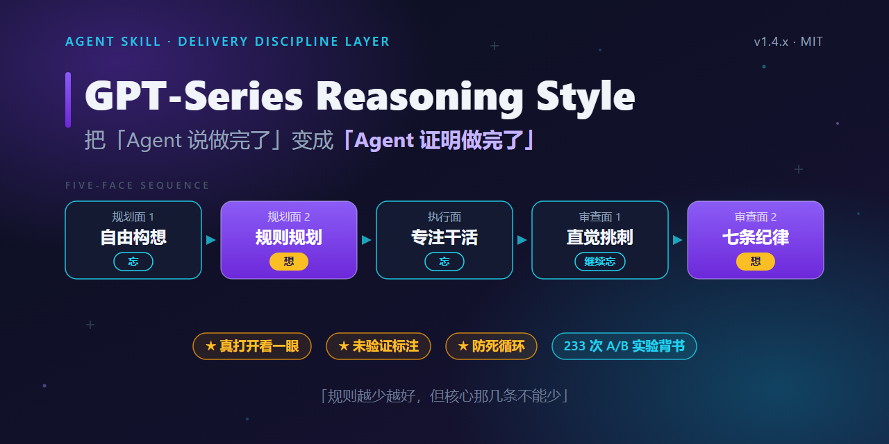
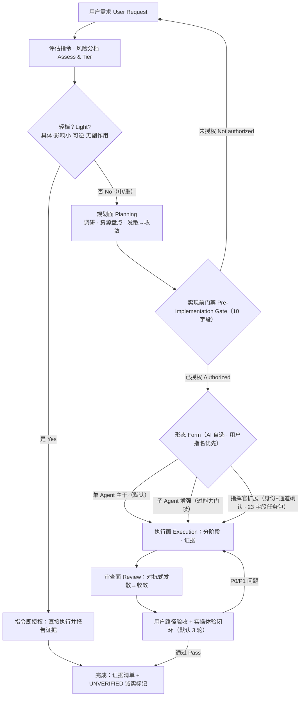

<div align="center">



# GPT系列推理风格（GPT-Series Reasoning Style）


<br>


**A delivery-discipline behavior layer for AI agents: it turns "the agent says it's done" into "the agent proves it's done" — a mandatory pre-implementation gate, one backbone with two on-demand collaboration forms, evidence-based adversarial review, and real-environment acceptance.**

**一个面向 AI Agent 的交付纪律行为层：把“Agent 说做完了”变成“Agent 证明做完了”——强制实现前门禁、一条主干加两种按需协作形态、基于证据的对抗式审查、真实环境验收。**

> Research before plan · Confirm before build · Evidence before claim · Accept in the real environment
>
> 先调研再规划 · 先确认再动手 · 先证据再结论 · 真实环境才验收

_Enable it when task complexity genuinely needs planning, verification, and review — not as a mandatory wrapper for every prompt. It disciplines process; it does not raise a model's raw reasoning ceiling._

_当任务复杂度确实需要规划、验证和审查时再启用，不是每个提示都要套的万能包装。它约束流程，不抬升模型本身的推理上限。_

**名称简注：** 别被名字误导——“推理风格”指它施加的**流程纪律**风格，不是提升模型推理上限；它是交付纪律层，不是推理引擎。

</div>

> Formerly / 曾用名：`gpt-5-6-sol-reasoning-style` — the old URL 301-redirects here / 旧链接自动 301 至本仓库。

---

## How It Works / 工作原理

It adds one backbone (three internal role faces) and two on-demand extensions. A mandatory gate blocks any file/command work before the user confirms; risk is trimmed so trivial tasks skip the heavy flow; final delivery requires real user-path and hands-on evidence.

它提供一条主干（三个内部角色面）和两个按需扩展。实现前有一道强制门禁，未经用户确认不得建文件或跑命令；按风险分档，琐碎任务跳过重流程；最终交付必须有真实用户路径与亲手操作的证据。



## Table of Contents / 目录

- [Quick Start / 快速开始](#quick-start--快速开始)
- [Features / 核心能力](#features--核心能力)
- [Execution Modes / 执行模式](#execution-modes--执行模式)
- [Identity Library / 身份库](#identity-library--身份库)
- [When To Use / 何时启用](#when-to-use--何时启用)
- [Before & After / 效果对比](#before--after--效果对比)
- [Not & Limits / 它不是什么与已知边界](#not--limits--它不是什么与已知边界)
- [Install / 安装](#install--安装)
- [Usage / 使用](#usage--使用)
- [Verification / 验证](#verification--验证)
- [Repository Layout / 目录结构](#repository-layout--目录结构)
- [FAQ / 常见问题](#faq--常见问题)
- [License / 许可证](#license--许可证)
- [Maintainer Notes / 维护者须知](#maintainer-notes--维护者须知)

## Quick Start / 快速开始

1. Clone or download this repository.
2. Copy the whole folder into your tool's skill directory, keeping the name `gpt-series-reasoning-style` (or run the install script in [Install](#install--安装)).
3. Invoke it by name; to confirm it really loaded, run the checks in `references/self-test.md`.

1. 克隆或下载本仓库。
2. 将整个文件夹复制到所用工具的 Skill 目录并保持名称 `gpt-series-reasoning-style`（或直接用[安装](#install--安装)小节的脚本）。
3. 按名称调用；想确认它真正生效，执行 `references/self-test.md` 的自测。

## Features / 核心能力

**Process discipline / 流程纪律**

- Three internal role faces — Planning, Execution, Review; the builder voice cannot close its own stage without an adversarial review pass.
- Mandatory pre-implementation gate (10 fields) before creating directories, editing files, or running implementation commands; announcing a stage sequence is not confirmation.
- Risk trimming: a specific, small, reversible, side-effect-free task takes the light channel (the instruction itself is authorization); brand-new products, multi-deliverables, and parallelism signals are excluded and take the full flow.
- Resource survey before planning: local skills, reusable assets, web references, and installable candidates (installing needs approval); a plan without a survey is incomplete.
- Whole-plan re-evaluation after any user change; a Resume Check (Git/gate/docs-vs-reality) before continuing an existing session.

- 三个内部角色面——规划面、执行面、审查面；执行者不能不经对抗式审查就自行关闭阶段。
- 建目录、改文件、跑实现命令前必须过实现前门禁（10 字段）；宣布阶段序列不等于获得确认。
- 风险分档：具体、影响小、可逆、无副作用的任务走轻通道（指令本身即授权）；全新产物默认中档（除非指令完整指定产物类型/位置/形态）、多交付物、并行信号被排除，走全流程。
- 规划前先做资源盘点：本地技能、可复用资产、网络参考、可安装候选（安装须经批准）；没盘点的计划不完整。
- 用户一改需求就从整体重新评估；接手既有会话前先做续会体检（Git / 门禁 / 文档与现实一致性）。

**Collaboration forms / 协作形态**

- Single-Agent backbone by default; Subagent enhancement and Commander Multi-Agent extension engage on demand and mix per stage; the AI self-selects a form with a one-line reason, and a user-named form always wins.
- Subagent capability gate: no real tool/config evidence means fall back to the backbone and mark it `UNVERIFIED`; subagents use a 6-field mini package, not the full package.
- Commander extension: role-identity confirmation + coordination-channel confirmation + the gate; a 23-field task package; a dispatch ledger persisted to project docs; a completion gate that forbids declaring done while any dispatch is open.
- Answer-handling protocol: self-consistency check → hands-on verification (file:line) → accept / return / `UNVERIFIED` → update ledger → next relay text → one sentence the user can reply with.

- 默认单 Agent 主干；子 Agent 增强与指挥官多 Agent 扩展按需启用、可按阶段混合；AI 自选形态并给一行理由，用户指名的形态永远优先。
- 子 Agent 能力门禁：没有真实工具/配置证据就回退主干并标 `UNVERIFIED`；子 Agent 用 6 字段迷你任务包，不用完整包。
- 指挥官扩展：角色身份确认 + 协调通道确认 + 实现前门禁；23 字段完整任务包；派发台账落盘到项目文档；完成门——存在未闭环派发时不得宣布完成。
- 回答接手协议：自洽检查 → 亲自核验（文件:行号）→ 接受/打回/`UNVERIFIED` → 更新台账 → 下一轮可转述文本 → 给用户一句可回复的话。

**Verification & honesty / 验收与诚实**

- User-path acceptance in the real target environment (web, desktop, mobile, CLI, API, library, docs); green unit tests are necessary but not sufficient.
- Hands-on experience loop for anything a human operates: personally exercise every button/key/gesture with screenshots, fix and re-test, capped at 3 rounds by default; a headless runtime marks un-operated surfaces `UNVERIFIED` instead of faking them.
- Generative divergence → convergence bug sweep and perspective rotation; divergence is not a fixed checklist (a medium task should surface ≥10 distinct candidates).
- Honesty signals: `UNVERIFIED`, `CONFIDENCE: High/Medium/Low`, `BLOCKED: reason, unblock`, findings graded P0/P1/P2; review-fix loops capped at 5 rounds.

- 在真实目标环境做用户路径验收（Web、桌面、移动、CLI、API、库、文档）；单元测试全绿是必要不充分条件。
- 人会操作的产物走实操体验闭环：亲手操作每个按钮/按键/手势并截图，修复后复验，默认上限 3 轮；headless 环境对无法操作的部分标 `UNVERIFIED`，不伪造。
- 生成式发散→收敛缺陷扫描与视角轮换；发散不是背固定清单（中等任务至少产出 10 个不同候选）。
- 诚实信号：`UNVERIFIED`、`CONFIDENCE: High/Medium/Low`、`BLOCKED: 原因, 解除条件`，发现按 P0/P1/P2 分级；审查-修复循环上限 5 轮。

**Engineering / 工程化**

- Progressive disclosure: loading proof needs only `SKILL.md` + `VERSION`; the 13 reference files load on demand.
- Optional one-line session-start hook (`hooks/`, opt-in) hedges "the model forgot to invoke the skill" — no resident context stuffing; the skill works fully without it. / 可选的一行会话启动提醒（`hooks/`，默认不装）对冲"忘记调用"，不做常驻上下文包装。
- Natural presentation: templates are content checklists, not literal formatting; role/channel/gate output is rendered as compact tables or short sentences, never code blocks.
- 22 built-in role-identity files under one 8-section contract; custom identities live in `custom-identities/`.
- Authorization matrix separates read, edit, implement, local commit, push, external/network execution, production, and legal/submission decisions; tool availability is not authorization.
- Roles are decoupled from the carrying model: the underlying model is optional metadata, never asked for, and a model change never invalidates a task package or ledger row.

- 渐进式加载：加载证明只需 `SKILL.md` + `VERSION`；13 份 references 按需读取。
- 自然呈现：模板是内容清单而非逐字格式；角色/通道/门禁用紧凑表格或短句呈现，不得用代码块。
- 22 个内置角色身份文件遵循统一 8 段契约；自定义身份放 `custom-identities/`。
- 授权矩阵把读取、修改、实现、本地提交、推送、外部/网络执行、生产、法律/提交决定分离；工具可用不等于获得授权。
- 角色与承载模型解耦：底层模型是可选元数据、从不主动询问，换模型不会使任务包或台账失效。

## Execution Modes / 执行模式

Collaboration architecture = **one Single-Agent backbone + two on-demand extensions**, mixable per task or stage.

协作架构 = **单 Agent 主干 + 两个按需扩展**，可按任务或阶段混合。

| Form / 形态 | When / 何时用 | External capability / 外部能力 | Task package / 任务包 |
| --- | --- | --- | --- |
| Single-Agent backbone / 单 Agent 主干 | Default; the model cycles Planning/Execution/Review internally / 默认，模型内部循环三面 | None required / 不需要 | Internal note / 内部派发说明 |
| Subagent enhancement / 子 Agent 增强 | Real independent parallel branches or isolated review, and the host has subagents / 有真正独立的并行分支或独立审查，且宿主有子 Agent | Real subagent tool evidence required / 需真实子 Agent 工具证据 | 6-field mini package / 6 字段迷你包 |
| Commander extension / 指挥官扩展 | Coordinating independent models/agents via direct tools, external sessions, or user relay / 经直接工具、外部会话或用户转交协调独立模型 | Independent recipient AIs / 独立接收方 AI | 23-field full package / 23 字段完整包 |

**Self-selection order / 模式自选顺序**（AI decides from task facts; the first match wins; user naming always overrides / AI 按任务事实判定，首个命中即停，用户指名永远优先）：

1. Light channel → execute directly / 轻通道 → 直接执行。
2. Commander triggers (any one): user asks for another AI/window/multi-model work; the task needs a capability this session lacks and another AI has it; user asks for independent third-party acceptance / 指挥官触发（任一）：用户点名交给别的 AI/窗口/多模型；任务需要本会话不具备而其他 AI 具备的能力；用户要求独立第三方验收。
3. Subagent (all required): host has the tool; genuinely independent parallel branches; parallelism gain beats briefing cost; no external model/window / 子 Agent（全部满足）：宿主有工具；分支真正独立；并行收益大于简报成本；无外部模型或窗口参与。
4. Otherwise: single-Agent backbone / 其余一律走主干。

Form selection is not implementation authorization — every form still passes its own confirmation gates. Detailed rules are in `references/agent-modes.md`; the 23-field package and DRI/ownership/authorization/context closure rules are in `references/multi-agent-closure-rules.md`.

形态选择不等于实现授权——任何形态都要过各自的确认门禁。详细规则见 `references/agent-modes.md`；23 字段任务包与 DRI、文件所有权、授权分离、上下文纪律见 `references/multi-agent-closure-rules.md`。

## Identity Library / 身份库

22 built-in identity files (21 role classes — `qa-engineer` and `test-engineer` both map to 测试工程师), each following the same 8-section contract: **Identity · Mission · Responsibilities · Process · Required Output · Handoff · Boundaries · Anti-Patterns**.

22 个内置身份文件（21 类角色——`qa-engineer` 与 `test-engineer` 同属测试工程师），每个都遵循统一 8 段契约：**身份定位 · 使命 · 职责 · 流程 · 必需输出 · 交接 · 边界 · 反模式**。

- Core / 核心：commander 总指挥、deputy-commander 副总指挥、executor 执行者、planner 计划者、deputy-planner 副计划者、requirements-analyst 需求分析师、architect 架构师、reviewer 审查者、code-reviewer 代码审查员、qa/test engineer 测试工程师、security-tester 安全测试员、acceptance-auditor 验收审计员、documentation-consistency-reviewer 文档一致性审查员、user-representative 用户代表。
- Optional / 可选：performance-engineer 性能优化员、deployment-release-engineer 部署发布工程师、privacy-compliance-reviewer 隐私合规审查员、legal-reviewer 专利法律审查员、integration-coordinator 集成协调员、risk-manager 风险管理员、documentation-writer 文档编写员。

The canonical per-role responsibility table is maintained **only** in `identities/README.md` (single source to prevent drift). Before asking a user to pick a role, show each candidate with a one-line responsibility — never a bare list of names. Custom identities go in `custom-identities/` (其他身份) and must be read before adoption. The universal contract, trust tiers (T1/T2/T3), and confidence protocol are in `references/identity-library.md`; role sets by project size are in `references/commander-roles.md`.

逐角色职责的权威表**只**在 `identities/README.md` 维护（单一来源以防漂移）。让用户选角前必须给每个候选附一行职责，不能只抛角色名。自定义身份放 `custom-identities/`（其他身份），采用前先读。统一契约、信任层级（T1/T2/T3）与置信度协议见 `references/identity-library.md`；按项目规模选最小角色集见 `references/commander-roles.md`。

## When To Use / 何时启用

The deciding factors are task complexity, host capability, and quality requirements — not whether a model is considered strong or weak.

判断标准是任务复杂度、宿主能力和质量要求，而不是模型本身“强”或“弱”。

| Scenario / 场景 | Recommendation / 建议 |
| --- | --- |
| Non-trivial multi-stage build + a tool-capable agent platform / 非平凡多阶段构建 + 可执行工具的 Agent 平台 | High value / 高价值 |
| Cross-model / cross-window / multi-AI collaboration / 跨模型、跨窗口、多 AI 协作 | Use the Commander extension / 用指挥官扩展 |
| Independent parallel branches + host has subagents / 独立并行分支 + 宿主有子 Agent | Use the Subagent enhancement / 用子 Agent 增强 |
| Complex task on a chat-only model (no tools) / 复杂任务但只有纯聊天模型 | Medium — the discipline applies, but the evidence/hands-on loop is limited / 中等：流程可遵循，证据与实操闭环受限 |
| Host already enforces full planning/review/verification / 宿主已自带完整规划-审查-验证 | Usually redundant / 通常重复 |
| One-off Q&A, tiny snippets, maximum-speed one-shot, high-volume low-risk work / 一次性问答、琐碎片段、追求最快一次成型、高频低风险任务 | Do not enable (use the light channel or answer directly) / 不启用（走轻通道或直接回答） |
| Single-turn or sub-10-minute tasks, even if non-trivial / 单轮对话或 10 分钟内可完成的小任务（即使不平凡） | Skip the full skill — pin [`docs/minimal-discipline.md`](docs/minimal-discipline.md) (three rules, ~500 tok) / 不装完整版——钉住速查卡（三条核心，约 500 tok） |

In short: enable it for multi-stage builds, shifting requirements, evidence-gated delivery, cross-model teamwork, and models that tend to skip planning; skip it for trivial, speed-first, or already-governed work.

简言之：多阶段构建、需求多变、需要证据验收、跨模型协作、或模型本身爱跳过规划时启用；琐碎、求快、或已被宿主流程覆盖的工作不启用。

如果宿主已经自带同等的规划 / 审查 / 验证流程，优先使用宿主原生能力（计划模式、二次确认对话框、审查门禁），而不是套本 skill——本 skill 是附加的纪律层，不替代宿主流程，只在宿主流程缺失或不足时才启用。给人给宿主都在管的纪律再套一层，纯属 Token 与延迟成本。

**宿主对齐 / Host Alignment**：首次使用时，AI 会在加载证明后输出一次「宿主对齐声明」——列出你宿主已有的能力、与本 skill 重叠的小节（标记 SKIP），经你确认后本次会话跳过重复部分；声明可落盘 `docs/agents/host-alignment.md` 供同项目复用。**证据报告、UNVERIFIED 标记、真实环境验收永远不可被跳过**——这三项是本 skill 的存在理由。

If your host already enforces equivalent planning / review / verification (native plan mode, confirmation dialogs, review gates), use those first --- this skill is an additive discipline layer, not a replacement; enable it only where the host's own flow is missing or too weak. Stacking redundant discipline costs tokens and latency for nothing.

## Before & After / 效果对比

**Without / 未启用**

```text
用户: 做一个贪吃蛇小游戏
模型: (跳过规划与确认，直接建文件、写代码、运行，然后声称完成)
```

**With / 启用后**

```text
用户: 使用 gpt-series-reasoning-style 做一个贪吃蛇小游戏
模型:
  【实现前确认】我理解的目标 / 风险分档(轻中重+理由) / 形态选择(+一行理由)
    / 已盘点可用资源 / 最高影响问题 / 推荐方案 / 其他选项 / 完整计划 / 澄清方式A·B / 需要你确认
  → 用户确认后：
  规划面：调研·资源盘点·发散→收敛·定阶段
  执行面：分阶段实现，每阶段附真实文件/命令/测试证据
  审查面：对抗式发散找缺陷 → 用证据收敛
  用户路径 + 实操闭环：亲手操作每个按键与反馈、截图，问题修复后复验（默认 ≤3 轮）
  收尾：证据清单 + 未验证项标 UNVERIFIED
```

## Not & Limits / 它不是什么与已知边界

**It is not / 它不是什么**

- Not an identity replacement — it adds behavior; the host agent's identity and platform rules take precedence / 不是身份替换，只叠加行为，宿主身份与平台规则优先。
- Not a model capability upgrade or a reasoning-ceiling booster / 不是模型能力增强器，不抬升推理上限。
- Not an agent runtime or orchestration framework (no scheduler, no engine) — it is a behavior layer that can sit on top of any framework / 不是 Agent 运行时或编排框架（不提供调度器或引擎），是可叠加在任何框架之上的行为层。
- Not a model ranking or leaderboard, and not a mandatory wrapper for every prompt / 不是模型排行榜，也不是每个提示都要套的强制包装。
- It does not decide for the user, and does not guarantee identical results across models or platforms / 不替用户决策，也不保证跨模型、跨平台效果完全一致。

**Known limits / 已知边界**

- Each invocation adds tokens and latency; the light channel and progressive loading keep this off trivial tasks / 每次启用增加 Token 与延迟；轻通道和渐进加载让琐碎任务不承担这个成本。
- The evidence loop depends on the host being able to run commands, tests, and screenshots; under a headless/CLI-only runtime the visual/interactive part can only be marked `UNVERIFIED` with user self-check steps / 证据闭环依赖宿主能否跑命令、测试和截图；纯 headless 环境下交互与视觉部分只能标 `UNVERIFIED` 并给出用户自验步骤。
- The Subagent and Commander extensions require real subagent tools or independent recipient AIs; absent that, it falls back to the backbone / 子 Agent 与指挥官扩展依赖真实子 Agent 工具或独立 AI，不具备时回退主干。

## Install / 安装

Copy or symlink the whole folder into your tool's skill directory and keep the folder name `gpt-series-reasoning-style`.

将整个文件夹复制或符号链接到所用工具的 Skill 目录，并保持文件夹名 `gpt-series-reasoning-style`。

**Upgrading from the former name / 从旧名升级**：if an old `gpt-5-6-sol-reasoning-style` folder exists in your skills directory (pre-rename install), **delete it** — the installer only writes the new folder and will not remove the old one, and the v1.0.0 leftover carries the outdated description and rules. 若你的技能目录里存在旧名 `gpt-5-6-sol-reasoning-style` 文件夹（改名前的安装残留），请**删除它**——安装脚本只写入新目录、不会移除旧目录，v1.0.0 残留带着过时的描述与规则。

**Script-supported platforms / 脚本支持的平台与 `-Platform` 参数**（project-level paths install into the current directory; `~` paths are per-user / 项目级路径装到当前目录，`~` 路径为用户级）：

| Platform / 平台 | Parameter / 参数 | Target directory / 目标目录 |
| --- | --- | --- |
| Generic Agent Skills, Antigravity（default / 默认） | `agents`（`antigravity` 同义） | `~/.agents/skills/` |
| Codex CLI / Desktop | `codex` | `~/.codex/skills/` |
| Claude Code | `claude` | `~/.claude/skills/` |
| Gemini CLI | `gemini` | `~/.gemini/skills/` |
| Kiro | `kiro` | `~/.kiro/skills/` |
| Goose | `goose` | `~/.config/goose/skills/` |
| OpenCode | `opencode` | `~/.config/opencode/skills/` |
| Cursor | `cursor` | `.cursor/rules/` |
| Windsurf | `windsurf` | `.windsurf/rules/` |
| Cline | `cline` | `.clinerules/` |
| Trae | `trae` | `.trae/rules/` |
| Roo Code | `roo` | `.roo/rules/` |

Windows (PowerShell):

```powershell
# default generic location / 默认通用位置
powershell -ExecutionPolicy Bypass -File .\scripts\install.ps1 -Platform agents
# overwrite an existing copy / 覆盖已存在的副本：加 -Force
```

macOS / Linux (bash):

```bash
chmod +x scripts/install.sh
./scripts/install.sh agents          # FORCE=1 to overwrite / 加 FORCE=1 覆盖
```

Platforms without a script parameter (e.g. VS Code Copilot) are installed manually by copying the folder; the full path list is in `references/platform-installation.md`.

没有脚本参数的平台（如 VS Code Copilot）手动复制文件夹即可；完整路径清单见 `references/platform-installation.md`。

## Usage / 使用

Invoke by name. The `$` prefix is a Codex-style trigger, not a requirement.

按名称调用即可。`$` 前缀只是部分平台的唤起语法，不是硬性要求。

仅当任务确实需要这套纪律时才**显式调用**，不常驻自动触发；只要三条核心规则、不想背整套治理时，直接摘用 [`docs/minimal-discipline.md`](docs/minimal-discipline.md) 写进宿主配置即可，不必装完整 skill。

```text
English:  Use $gpt-series-reasoning-style to execute this task in this reasoning style.
中文:     使用 $gpt-series-reasoning-style 按本推理风格执行本次任务。
```

Only `SKILL.md` loads up front; each reference file is read on demand when its phase needs it.

首屏只加载 `SKILL.md`；各 reference 在对应阶段需要时才按需读取。

## Verification / 验证

- **Loading proof / 加载证明**：state the version, quote the first gate hard rule verbatim (`宣布阶段序列不是确认。`), summarize the backbone+two-extension architecture, and list the files actually read.
- **Self-test / 自测**：`references/self-test.md` contains 77 tests (Test 1–77) covering language & identifier fidelity, authorization boundaries, the three forms, capability gates, role confirmation, task packages, trust tiers, the dispatch ledger, the hands-on loop, the light channel, and conflict-freeze behavior.
- **Real-environment acceptance / 真实环境验收**：before final delivery, validate every deliverable in its real target environment — unit tests passing is not sufficient.
- **Field tests / 实测报告**：the skill is also verified by adversarial field tests — an end-to-end commander-form run and a three-round probe series, each round exposing one real rule defect (template desync, light-channel bypass, rule contradiction) that was fixed and fed back; the probes are scripted and re-runnable via [`probes/probe-runner.py`](probes/probe-runner.py); reports in [docs/field-tests/](docs/field-tests/).
- **Evidence strength / 证据强度（读结论前先读这行）**：blind tests are n=1 per cell with a proxy judge and a non-neutral baseline — they prove the **mechanisms exist and change process**, not that **defects decrease**; read the two claims separately. External reviews (including critical ones) are archived under [docs/reviews/](docs/reviews/).
- **证据强度**：盲测每格 n=1、裁判为代理模型、基线不中立——它们证明的是**机制存在且能改变流程**，不是**缺陷会减少**；这两个结论分开记账。外部评审（含批评性评审）归档于 [docs/reviews/](docs/reviews/)。

- **加载证明**：输出版本号、逐字引用门禁硬规则第一条（`宣布阶段序列不是确认。`）、简述“主干+两扩展”架构、列出实际读过的文件。
- **自测**：`references/self-test.md` 含 77 条（Test 1–77），覆盖语言与标识符保真、授权边界、三种形态、能力门禁、角色确认、任务包、信任层级、派发台账、实操闭环、轻通道与冲突冻结。
- **真实环境验收**：最终交付前在真实目标环境验证每个交付物，单元测试通过并不充分。
- **实测报告**：本 skill 还用对抗式实测验证自身——一次指挥官形态端到端实测与三轮探针系列，每轮抓出一层真缺陷（模板脱节、轻通道旁路、规则自相矛盾）并修复回灌；探针已脚本化可重跑（[`probes/probe-runner.py`](probes/probe-runner.py)）；报告见 [docs/field-tests/](docs/field-tests/)。

## Repository Layout / 目录结构

```text
gpt-series-reasoning-style/
├── SKILL.md                     # 入口：加载证明、协作架构、实现前门禁、工作流
├── VERSION                      # 1.1.0
├── CHANGELOG.md                 # 变更历史
├── INTERNAL-HISTORY.md        # 内部迭代历史（0.1.x–3.x 归档，仅追溯）
├── README.md
├── LICENSE                      # MIT
├── generate-banner.py           # 社交预览图生成脚本（维护用）
├── social-preview.png / .svg    # 社交预览图
├── .gitattributes               # 行尾策略：仓库与工作树统一 LF（* text=auto eol=lf）
├── .github/                     # CI：selfcheck 工作流（push/PR 触发）
├── AGENTS.md                    # 跨运行时入口别名（Codex/Gemini/Copilot CLI 识别，指向 SKILL.md）
├── agents/openai.yaml           # OpenAI/Codex 兼容界面的可选元数据（display_name/default_prompt）
├── identities/                  # 22 个内置身份 + _template + README（权威角色目录）
├── custom-identities/           # 用户自定义身份（其他身份）
├── references/                  # 13 份按需加载的详细规则
│   ├── series-reasoning-workflow.md   # 完整流程与审计模板（中文权威版）
│   ├── series-reasoning-workflow-en.md # 同上 · English mirror（权威为中文版，冲突以中文为准）
│   ├── project-artifacts.md           # 门禁单/台账/证据的落盘约定与状态机
│   ├── agent-modes.md                 # 协作架构、模式自选、任务包
│   ├── identity-library.md            # 身份契约、信任层级、置信度
│   ├── commander-roles.md             # 角色库与按规模选角
│   ├── multi-agent-closure-rules.md   # 多 Agent 闭环（权威 23 字段任务包）
│   ├── series-reasoning-lessons.md    # 反模式与教训
│   ├── common-failures.md             # 高频造假对照表 + 本仓库失败案例
│   ├── series-reasoning-examples.md   # 行为示例
│   ├── platform-installation.md       # 全平台安装路径
│   ├── project-policy-template.md     # 项目级策略模板
│   └── self-test.md                   # 77 条安装后自测
├── docs/field-tests/            # 实测证据：端到端实测 + 三轮对抗探针报告
│   ├── blind-test/              # 第三方盲测报告（2026-09-08、2026-09-09 A/B）
│   └── ab-baseline/             # A/B 基线评测（协议 + 12 样例；两轮已完成，见 judgement-sheet）
├── docs/proposals/              # 规则审计提案（如 2026-09-09-rule-audit-probe-c）
├── docs/reviews/                # 外部评审汇总裁决书（2026-09-09-three-ai-audit-verdict）
├── docs/minimal-discipline.md   # 最小纪律速查卡（三条核心常驻）
├── hooks/                       # 可选的一行会话启动提醒（opt-in，默认不装）
├── site/                        # 静态单页文档站（GitHub Pages 可直接指向）
├── probes/
│   ├── probe-scenarios.json        # 对抗探针场景（三轮，可重跑）
│   ├── probe-runner.py             # 探针驱动：list/archive/report
│   └── last-run.md                 # 逐轮判分留痕（append-only）
└── scripts/
    ├── install.ps1              # Windows 安装脚本
    ├── install.sh               # macOS / Linux 安装脚本
    ├── selfcheck.py             # 静态自检：一致性/防漂移（机器可判）
    ├── selftest-runner.py       # 自测驱动/归档：list/schema/archive
    └── artifact-check.py        # 用户项目治理产物结构校验（gate/台账/账本）
```

## Language Policy / 语言策略

This skill is **layered bilingual**, not a per-file mirror translation. Chinese is the primary voice;
English carries the deep reference rules. The matrix below sets reader expectations per layer, so a jump
between layers is a designed feature, not a bug.

本 skill 是**分层双语**，不是逐文件镜像翻译。中文为主导语意，英文承载深度规则。下表让读者对每一层有
预期——层间切换是设计特性，不是缺陷。

| Layer 层 | Content 内容 | Language 语言 |
| --- | --- | --- |
| 入口 SKILL.md | 门禁模板、协作架构、加载证明 | 中文为主，术语用英文（UNVERIFIED / P0-P2 / Pre-Implementation Gate） |
| 门面 README | 安装、使用、FAQ、维护 | 逐段双语 EN+CN |
| 深规则 references/ | workflow / lessons / self-test / identity-library / commander-roles / platform-installation | 英文为主（agent-modes / closure-rules 英文带中文） |
| 英文镜像 references/series-reasoning-workflow-en | workflow 的全英镜像（含中文版中文独占块的英译） | 全英文（权威为中文版，冲突以中文为准） |
| 产物约定 references/project-artifacts | 门禁单/台账/证据落盘约定 + 校验工具 | 中文为主 |
| 对照表 references/common-failures | claims↔最小充分证据对照 + 本仓库失败案例 | 中文为主（claim 列含英文原文） |
| 示例 references/examples | 行为示例 | 中文为主 |
| 身份 identities/ | 22 个角色契约 | 逐段双语 EN+CN |
| 实测 docs/ | 端到端 / 探针 / 盲测报告 | 中文为主，关键词双语 |
| 速查卡 docs/minimal-discipline | 三条核心常驻 | 中文为主 |
| 策略模板 references/project-policy-template | 项目策略填空模板 | 英文（模板即交付文案，默认英文） |

Chinese readers enter through SKILL.md and read the examples and field reports; English readers treat
references/ as the rule authority. Dual readers cross layers as designed.

中文读者以 SKILL.md 为入口、借示例与实测报告理解行为；英文读者以 references/ 为规则权威。双语读者按层
跨读，正是设计意图。

## Complexity Budget / 复杂度预算

This skill must obey its own discipline: a checker must earn its existence with evidence.
本 skill 自身也要遵守本 skill 的纪律——**检查器必须用证据挣得存在**。

- **SKILL.md 门面 ≤ 250 行**。它是唯一每次调用必载的表面，中文为主、仅保留英文入口指引（完整英文规则在 references 的 EN sections），不再加长——新内容一律下沉到 references/。
- **静态检查上限 16 项（SB1–SB16）**：新增第 17 项前，必须先证明它抓到过至少一个真实缺陷（可指认提交哈希）；抓不到就不加。
- **行为自测冻结在 77 条**：只做「旧测失去鉴别力 → 替换」，不再扩容。
- **长参考文档（500+ 行）不做全文双语强制**：SB16 分级（tier-A 规则面严查 / tier-B 仅 informational），避免「永远红」与「文件翻倍」二选一。
- **收敛优先于加码**：改动清单里出现「新增规则 / 新增检查」时，先问能否用修订现有条文达到同样效果。

## FAQ / 常见问题

**Q: 宿主不支持 `$` 前缀怎么办？**
直接按名称调用，例如“使用 gpt-series-reasoning-style 执行本次任务”。`$` 只是部分平台的唤起语法。

**Q: 怎么确认安装成功、真正生效？**
看加载证明（版本 + 逐字硬规则第一条 + 架构简介 + 读过的文件清单），再按 `references/self-test.md` 跑 77 条自测。

**Q: 会让所有任务都变慢、多花 Token 吗？**
不会。它只在你主动调用时加载，首屏只有 `SKILL.md`；具体、可逆、无副作用的轻任务走轻通道，几乎不加流程；简单任务直接回答即可。

**Q: 必须有子 Agent 或多个模型才能用吗？**
不必。单 Agent 主干是默认，绝大多数任务由一个模型内部切换三面即可完成；子 Agent 与指挥官扩展只在任务确实需要、且能力被证据证实时才启用。

**Q: 和 AutoGen / LangGraph / CrewAI 这类框架什么区别？**
它们是 Agent 运行时/编排框架，提供调度引擎、状态图或角色流水线；本 Skill 是模型无关、平台无关的**行为覆盖层**，规定“先调研再规划、实现前确认、分阶段带证据、审查面收口、真实环境验收”这套纪律。它不替代任何框架，反而可以叠加在这些框架或任意模型之上。

**Q: 纯聊天模型（没有执行工具）能用吗？**
能用上结构化规划、澄清和审查输出，价值中等；但跑命令、测试、截图、实操这类证据闭环无法自证，相关结论只能标 `UNVERIFIED`。

**Q: 宿主已经自带规划/审查流程，还需要吗？**
可以叠加但通常没必要。它不替换宿主身份与平台规则；宿主已有同等纪律时，再套一层是重复负担。

## License / 许可证

MIT License — see [LICENSE](LICENSE). 本项目采用 MIT 许可证，详见 [LICENSE](LICENSE)。

## Maintainer Notes / 维护者须知

Gate fields and hard rules are deliberately repeated across several surfaces (anti-drift by design, because references load on demand). When you change any of them, sync **all** of these surfaces in the same version — a field test showed that a rule missing from even one surface makes the model silently skip it:

门禁字段与硬规则刻意在多个表面重复（按需加载下的防漂移设计）。改动任一项时，必须在同一版本同步以下**所有**表面——缺一个表面，模型就会在实测中悄悄跳过它：

1. `SKILL.md` gate field list / 门禁字段清单
2. `references/series-reasoning-workflow.md` gate template / 门禁模板
3. `references/series-reasoning-workflow-en.md` English mirror of the same template / 同一模板的英文镜像
4. `agents/openai.yaml` `default_prompt`
5. `README.md` gate example (Before & After) / 门禁示例（效果对比）
6. `references/agent-modes.md` + `references/multi-agent-closure-rules.md` rule bodies (EN + ZH) / 规则正文（中英）
7. `references/self-test.md` expectations / 自测期望

Other single-source-of-truth rules to keep consistent when editing / 其他改动时需保持一致的“单一权威”约定：

- The authoritative task-package field count is **23**; the subagent mini package is **6** fields; fix-loop cap **5**; hands-on loop default **3**; self-test **77**; built-in identity files **22** (21 role classes). / 任务包权威 **23** 字段、子 Agent 迷你包 **6** 字段、修复循环上限 **5**、实操闭环默认 **3** 轮、自测 **77** 条、内置身份 **22** 个文件（21 类角色）。
- The per-role responsibility catalog lives only in `identities/README.md`; every identity file keeps the 8-section contract. / 逐角色职责目录只在 `identities/README.md` 维护；每个身份文件保持 8 段契约。
- The light-channel exclusions (new-from-scratch product defaults to medium; ≥2 deliverables; parallelism signals) and the mode self-selection order must match across `SKILL.md`, `series-reasoning-workflow.md`, `agent-modes.md`, and `self-test.md`. / 轻通道三排除项（全新产物默认中档、≥2 交付物、并行信号）与模式自选顺序须在 `SKILL.md`、`series-reasoning-workflow.md`、`agent-modes.md`、`self-test.md` 间一致。
- The install platform list here must match the actual `-Platform` keys in both `scripts/install.ps1` and `scripts/install.sh`; platforms without a key are documented as manual-only. / 本文件安装平台表必须与两个安装脚本真实支持的 `-Platform` 参数一致；无参数平台标注为手动安装。
