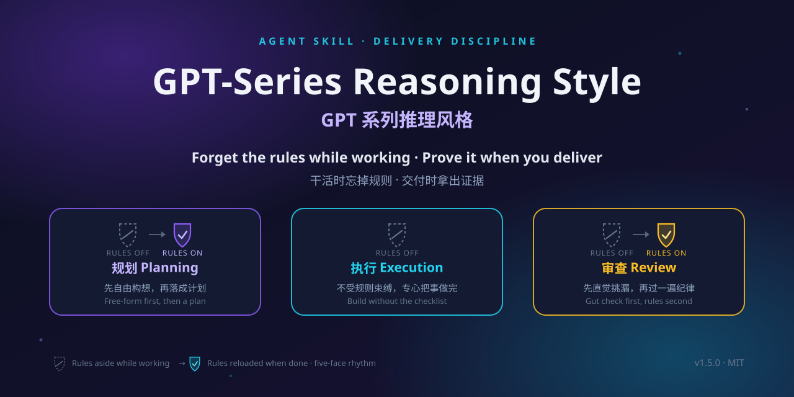

<div align="center">

# GPT-Series Reasoning Style

**把"Agent 说做完了"变成"Agent 证明做完了"。**
**Turn "the agent says it's done" into "the agent proves it's done".**



[](#versioning--版本)
[](#license--许可证)
[](#cost--成本)
[](#field-tests--实测与证据)
[](#cost--成本)

</div>

> **Process-discipline layer only** — not a reasoning-capability booster and not GPT-specific —
> the name records its origin (distilled from a long series of GPT-series model dialogues).
>
> 本 skill 是**交付验收与多智能体协作纪律层**：不提升模型推理能力，也不绑定 GPT 系列——名字记录的是
> 它的来源（从一系列 GPT 系列大模型的真实对话中打磨提炼）。中文主导。

---

## Why / 为什么需要它

AI agent 最常见的失败不是"不会做"，而是**没验过就说做完了**：

- 测试没真跑，宣布"全部通过"；
- HTML 没在浏览器里打开过，宣布"页面没问题"；
- 关键数字没重算，照抄第一遍的结果。

这不是个别现象。在四轮独立复现、共 14 个实验臂的对照实验里，AI **无一例外自报"测试全过、验证有效"**，而独立复查仍然判出大量真实缺陷。这个 gap 才是交付风险的大头——它决定的不是"做得快不快"，而是**你敢不敢直接用它的产出**。

本 skill 不教模型怎么写代码。它只管一件事：**让"完成"这个词有证据**。装上之后，交付从一句"我做完了"变成可核查的三件套：

> **做了什么 / 怎么验的（给可复现命令）/ 哪些没验（逐条写原因）**

---

## How It Works / 装上之后会发生什么

装上后**无需任何特殊指令**。当 agent 接到交付型任务（写代码、算数据、做页面、多 Agent 分工），它会自动进入一个五面节奏——核心是"忘与想"的交替：`忘 → 想 → 忘 → 继续忘 → 想`。

```text
┌─ 规划面1（自由构想，忘记skill）——先不被任何纪律框住，纯凭判断力想清楚要做什么
│         ↓
┌─ 规划面2（规则规划，想起skill）——把构想落成计划：风险分级、是否拆子Agent、怎么沟通
│         ↓
┌─ 执行面（彻底忘记skill）——专心干活，纪律完全退场，不打断思路
│         ↓  触发点：当它觉得「我做完了」
┌─ 审查面1（直觉检查，继续忘记skill）——不用规则，凭直觉挑刺：哪里不对？哪里漏了？
│         ↓
└─ 审查面2（纪律检查，想起skill）——严格过一遍七条纪律，规则覆盖到的必须都做到
```

设计意图就两句话：

- **创作时没有纪律**——规划第一遍和整个执行阶段彻底"忘记" skill，规则不污染思路；
- **检查有两道**——直觉抓规则**没覆盖到**的问题，纪律确保规则**覆盖到**的都做到，互不替代。

<details>
<summary><b>轻任务与重任务怎么自动分级？（规划时自过的七件事）</b></summary>

1. **形态判断自己心里做**——不输出决策过程，不跟用户汇报"我选择了什么形态"，直接干活。
2. **协作形态可叠加**——同一任务可以自己干一部分（形态一）、派子 Agent 干一部分（形态二）、协调外部模型干一部分（形态三）；默认形态一起步，哪里需要并行/独立/跨模型就叠加哪里。
3. **轻量档**——只做分工方案、不实际派发时，不建 `_agents/` 目录、不写任务包文件；方案获批准后再展开。
4. **小且可逆 = 指令即授权**——直接做、别请示；只有不可逆、对外发布、删东西才事前确认。
5. **按风险分级**——轻任务只做 3 条纪律（真打开看一眼 / 未验证标注 / 防死循环）；数据/代码/多 Agent 类重任务做全 7 条。
6. **动手前先调研**——重任务先花几分钟查网上怎么做、有什么坑、有没有最佳实践，不凭感觉瞎写。
7. **最后确认档位**——跟用户确认沟通方式：**A 档**一次性确认（推荐方案列出，同意就开干）或 **B 档**逐项问答（一次一个最高影响问题）；用户没说默认 A 档。

</details>

---

## Install / 安装

按你的运行时选一种（用多个就各装各的）：

### Claude Code / WorkBuddy 等目录型运行时

```bash
git clone https://github.com/JadeYingWah/gpt-series-reasoning-style
cp -r gpt-series-reasoning-style ~/.claude/skills/    # WorkBuddy 用 ~/.workbuddy/skills/
```

> **拷整个文件夹，不要只拷 `SKILL.md`**——`references/` 与 `templates/` 是按需加载的，缺了它们，多智能体场景会失效。

### Codex / Gemini CLI / Copilot CLI 等 AGENTS.md 运行时

```bash
git clone https://github.com/JadeYingWah/gpt-series-reasoning-style
cd gpt-series-reasoning-style    # 在仓库目录内启动 agent，AGENTS.md 入口路由自动生效
```

路由只做一件事：让 agent 读 `SKILL.md` + `VERSION` 完成加载，其余文件按需读取。

### 更新与验证

```bash
git pull    # 更新；版本号见 VERSION 文件
```

验证装好了：问 agent「**你的版本号是多少？加载证明需要哪几个文件？**」——应答 `1.4.49`，说得出五面时序，并能逐字引用第 1 条纪律。

---

## Usage / 触发方式

- **自动触发**（由 `SKILL.md` 的 description 决定）：涉及数字验算、代码交付、多 Agent 协作、需要防假完成的任务；或用户说"做完了帮我查 / 看看对不对 / 验收"；或提到"假完成、未验证、UNVERIFIED、任务包、指挥官、多 Agent"。
- **显式点名**：`使用 gpt-series-reasoning-style 执行本次任务。`
- **不加载**：一句话问答、纯聊天、小且可逆的改动——纪律不该出现在不需要它的地方。

---

## Rules / 七条纪律

审查面2 严格过这 7 条（顺序与 `SKILL.md` 一致；★ = 轻任务也必须做的 3 条）：

| # | 纪律 | 要点 |
|---|---|---|
| 1★ | **真打开看一眼** | 产物在真实环境打开、真用一遍——HTML 要浏览器渲染、API 要前端调，跑脚本不算。环境不支持时：如实标"未验证：浏览器渲染"+ 给用户自验步骤 |
| 2★ | **未验证标注** | 交付只说三件：做了什么 / 怎么验的（给可复现命令）/ 哪些没验。没验的逐条列原因，不许只写"部分未验证" |
| 3 | **失败两次换路** | 同一动作连续失败第 2 次，禁止同法第 3 次；先判断是否与已验路径等价，别死磕 |
| 4 | **全绿不算证据** | 把要防的错误故意做一次，断言红才算验过；变异后照样全绿 = 变异没生效。最小菜谱：每个写入口至少打 空值/超长/非法类型/缺键 |
| 5 | **关键数字重算** | 数据/研究类交付的关键数字，独立方法重算或双源交叉；对不上以重算为准 |
| 6 | **临时物隔离** | 临时文件不进交付目录、收尾清掉；清理只动本任务自己的目录，禁全局杀进程 |
| 7★ | **防死循环** | 同一文件连读 3 次无新信息就停；同一动作连续 3 次输出相同就换思路 |

---

## Multi-Agent / 多智能体协作

细则在 `references/multi-agent.md`（命中才读），角色卡模板在 `templates/`。

### 形态二 · 子智能体（有明显增益就自觉开，不等用户说）

**命中任一就开**：完全独立的子活 / 要并行跑两件事 / 要独立挑刺视角 / 中间过程怕污染主上下文。
派发给清三样：**目标、完成标准、交回给谁**。铁律：子智能体交回后**主 Agent 仍是 DRI**，必须自己验收；子智能体不直接对用户；一个人能连贯干完的事不开二。

### 形态三 · 多智能体（用户指名 / 跨模型 / 大任务分工）

六步：指挥官身份声明 → 建立角色档案 → 拆子任务写任务包 → 用户转述派发 → 对照原始目标验收（先查跑偏，再交审查者挑刺）→ 向用户汇报三件套。

**任务包七要素**：背景 / 已定决策 / 未定缺口 / 完成标准 / 允许与禁止范围 / 唯一 DRI / 交回给谁。

**三个角色卡**（`templates/`）：**指挥官**默认 DRI，委派不转移最终责任；**执行者**只说"按标准做完了，请验收"；**审查者**独立挑刺、不亲自改活。
**红线**：执行者说「我做完了」不算验收；审查者不亲自改；不绕开指挥官直接汇报。

---

## Field Tests / 实测与证据

这个 skill 的每一次删减与保留，都是 A/B 实验投出来的票。**累计 233 次实验**：

| 阶段 | 版本 | 实验次数 | 结论 |
|---|---|---|---|
| v1.2.x 重版本 | 3043 个文件 / 179 行 | **207 次** | **规则越多效果越差** |
| v1.4.x 极简版 | 6 个文件 / 59 行（实测） | **26 次** | **有用，且无负面影响** |

**233 次实验最终证明的四件事：**

1. **重版本是错的**——规则越多效果越差，207 次实验证明了。
2. **极简版是对的**——59 行，有用，没副作用，26 次实验证明了。
3. **核心价值是真的**——「真打开看一眼」「未验证标注」，这几条是真有用。
4. **没有负面影响**——轻任务上价值小，但也没坏处。

> **233 次实验测出来的不是"规则越多越好"，而是"规则越少越好，但核心那几条不能少"。**

四个 test-bed 的实测定性结论（原始记录本地留存）：

| 测试场 | 设计 | 任务类型 | 定性结论 |
|---|---|---|---|
| Test-Bed 1 | 单臂 ×6 | 轻任务 | 轻任务上价值小，但无副作用 |
| Test-Bed 2 | 单臂 ×5 | 中等任务 | 不提升代码质量，提升交付可信度（评估记录整理中） |
| Test-Bed 3 | **A/B 双臂** | 创意任务 | 「真打开看一眼」抓到 5 处视觉问题，结构校验抓不到 |
| Test-Bed 4 | **A/B 双臂** | 复杂创意 | **进行中**——A/B 臂判分未定稿，不预设结论 |

**口径边界：** 本 skill 的可证价值在**交付可信度与验证习惯**；**不声称**"降低致命缺陷率"或"兜底"——233 次实验测出的是什么就说什么，不做超出实验支持的宣传。

---

## What It Is Not / 诚实边界

- **不提升推理能力**，也不是 GPT 专用——名字记录的是来源，不是适用范围；
- **不兜底**——不声称降低致命缺陷率，实验口径不支持这种宣传；
- **不是加速器**——它常让你多花几分钟验证，换的是"敢直接用"的交付；
- **不是流程绑架**——执行阶段纪律完全退场，创作不被打断；轻任务几乎无感。

---

## Philosophy / 设计哲学

- **规则越少越好，但核心那几条不能少**——233 次实验的最终结论；
- **创作是创作，检查是检查**——忘/想交替的全部理由；
- **证据高于声称**——全绿不算证据，断言红过才算验过；
- **责任不随委派转移**——子智能体交回后，主 Agent 仍是 DRI。

---

## What's Inside / 仓库结构

| 文件 | 角色 |
|---|---|
| `SKILL.md` | **规则权威**。运行时只加载它 + `VERSION` |
| `AGENTS.md` | 跨运行时入口路由（Codex / Gemini CLI 等），仅指路，无规则 |
| `references/multi-agent.md` | 形态二三细则：命中信号、派发规范、六步操作、红线 |
| `templates/` | 指挥官 / 执行者 / 审查者三张角色卡 + 任务包七要素 |
| `scripts/selfcheck.py` | 仓库一致性自检（21 项，纯只读） |
| `SECURITY.md` | 安全模型说明 |
| `social-preview.svg / .png` | 仓库横幅图（1280×640） |

---

## Cost / 成本

| 项目 | 实测值 |
|---|---|
| SKILL.md | 6043 字节 / 59 行（常驻 ~1.5k token） |
| 运行时按需文件 | 共 6 个（SKILL.md + VERSION + 1 references + 3 templates），合计 10676 字节 |
| 加载路径 | 平时只读 SKILL.md + VERSION，不列目录、不读其他；叠加形态二三才读 `references/multi-agent.md` 与 `templates/` |

**对比 v1.2.5 重版本**：38.7KB / 179 行 / ~12k token——已被实验证明是错的（见上）。

---

## Versioning / 版本

当前版本：**1.4.49**

- **v1.4.x 极简线**：三阶段五面、协作形态叠加、按需加载——当前主线，**26 次 A/B 实验背书**。
- **v1.2.x 重版线**：179 行、模块矩阵、self-test 冻结 77 条——**207 次实验证伪**，该线已废弃。

---

## License / 许可证

MIT
