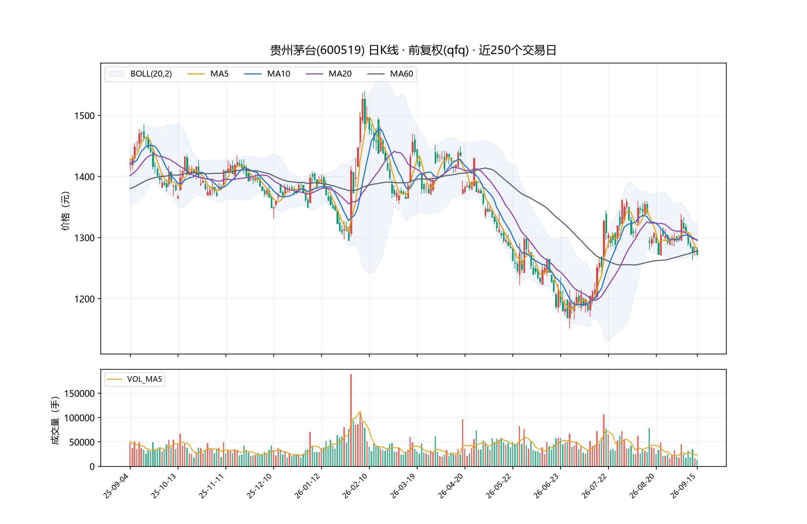
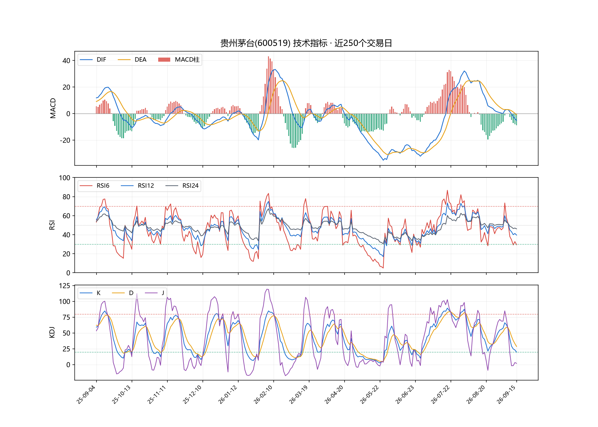
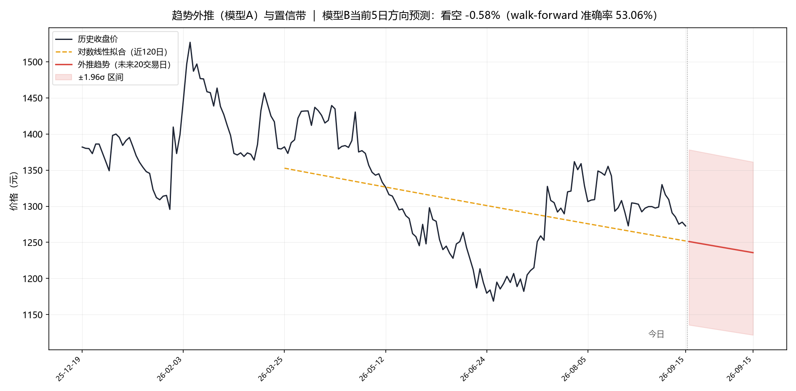
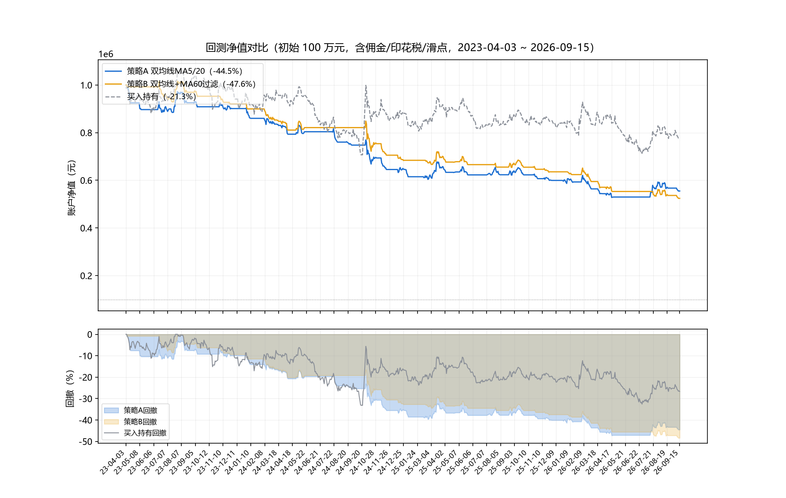

# 贵州茅台（600519）股票分析报告

> A股 · 前复权(qfq) · 日线 ｜ 数据区间 2023-01-03 ~ 2026-09-15（898 个交易日） ｜ 数据源：腾讯财经行情接口 web.ifzq.gtimg.cn ｜ 生成时间：2026-09-16 16:15

> 本报告由自动化流水线生成，仅供研究演示，不构成投资建议。

## 一、摘要

- 数据：贵州茅台(600519) 前复权(qfq)日线 2023-01-03 ~ 2026-09-15 共 898 个交易日，区间累计涨跌 -17.92%。
- 最新收盘 1272.75 元（2026-09-15），空头排列(MA5<MA10<MA20)，价格相对MA20 -1.82%、相对MA60 -0.45%。
- 动量：MACD 死叉运行、柱体放大；RSI6=29.4（偏超卖(<30)）；KDJ K线在D线下方；20日年化波动率 16.81%。
- 预测：模型B walk-forward 方向准确率 53.06%（基线 最高54.69%），不具备稳定预测边际；当前5日方向预测：看空（-0.58%）。
- 回测（2023-04-03~2026-09-15）：策略A总收益 -44.49%/回撤 -47.25%；策略B -47.57%/-48.42%；买入持有 -21.31%/-33.23%。
- 操作参考：趋势结构偏空：价格位于MA60下方且MA20向下；关键位 支撑 1151.01 / 压力 1363.35 / 止损参考 1230.07。
- 声明：本报告由历史数据自动生成，仅供研究演示，不构成任何投资建议。

## 二、行情数据概览

| 项目 | 数值 |
|---|---|
| 最新收盘 | ¥1272.75（2026-09-15） |
| 区间累计涨跌 | -17.92% |
| 20日年化波动率 | 16.81% |
| 区间最高/最低 | 1806.54（2024-10-08）/ 1142.37（2024-09-19） |
| 日均成交量 | 32,610 手 |

## 三、K线图与技术指标

| 指标 | 数值 | 解读 |
|---|---|---|
| MA5 / MA10 / MA20 / MA60 | 1280.38 / 1295.36 / 1296.30 / 1278.52 | 空头排列(MA5<MA10<MA20) |
| MACD(12,26,9) | DIF -5.27｜DEA -0.90｜柱 -8.75 | 死叉运行、柱体放大 |
| RSI(6/12/24) | 29.4 / 39.5 / 46.1 | 偏超卖(<30) |
| KDJ(9,3,3) | K 19.6｜D 28.5｜J 1.9 | K线在D线下方 |
| BOLL(20,2) | 上 1324.97｜中 1296.30｜下 1267.63 | 带内，距中轨-1.82%；带宽4.4%（近1年分位 14%） |
| ATR(14) | 21.34（占价比 1.68%） | 日均真实波幅，用于止损定位 |
| 量能 | 量比(今/5日均) 0.59 | 缩量 |
| 52周区间 | 1168.63 ~ 1526.98 | 现价位于52周区间 29% 分位 |

## 四、趋势预测模型

- **模型A（对数线性外推20日）**：年化趋势斜率 -15.12%，外推终点 1235.79 元（±1.96σ 区间 1121.78~1361.39），仅刻画趋势非预测。
- **模型B（岭回归 5日收益，walk-forward 245 日）**：方向准确率 **53.06%**（基线：全看多 41.63%、动量延续 54.69%）；MAE 2.483%，相关系数 0.084；当前5日预测 -0.58%（看空）。
- **诚实结论**：样本外不优于基线，该特征集不具备稳定预测能力。短期方向接近随机游走。

## 五、回测验证

回测区间 2023-04-03 ~ 2026-09-15；假设：收盘计算，次日开盘执行（T+1），万2.5/边，最低5元，印花税卖出0.05%（卖出），滑点0.05%，整手，无止损，初始 100 万元。

| 指标 | 策略A 双均线 | 策略B +MA60过滤 | 买入持有 |
|---|---|---|---|
| 总收益 | -44.49% | -47.57% | -21.31% |
| 年化收益 | -15.67% | -17.05% | -6.70% |
| 夏普(rf=0) | -1.27 | -1.62 | -0.18 |
| 最大回撤 | -47.25% | -48.42% | -33.23% |
| 平仓次数/胜率 | 29 / 24.10% | 38 / 10.50% | 1 / — |
| 持仓占比 | 43.3% | 30.6% | 100% |

逐笔记录：`data/backtest_trades_A.csv`、`data/backtest_trades_B.csv`；净值：`data/backtest_equity.csv`。

## 六、交易策略建议

**当前判断**：趋势结构偏空：价格位于MA60下方且MA20向下。

- 防守为主：空仓者不急于抄底，反弹至MA20压力带（约 1296 元附近）考虑减仓；未持仓者等待趋势企稳信号。
- 动量偏空：MACD 死叉且绿柱运行，反弹以修复性质对待，避免追高。
- 短线偏冷：RSI6 进入超卖区，急跌后存在技术性反抽需求，但需右侧确认。

关键价位：支撑 1151.01（近60日低点）｜压力 1363.35（近60日高点）｜移动止损参考 1230.07（收盘−2×ATR）。

- 仓位：单一标的建议不超过总资金的 20%–30%，避免全仓押注单一信号。
- 止损：以 2×ATR（约 1230.07 元，即收盘下方约 3.4%）作为移动止损参考，跌破果断执行。
- 执行：A股 T+1，隔夜跳空与停牌风险无法用日内止损规避，仓位即为风控的第一道闸。
- 纪律：本报告所有信号均基于历史统计，实际执行前应结合基本面与自身风险承受能力独立决策。

## 七、方法局限与风险声明

> 预测仅基于历史价量，未含基本面/资金面；回测为理想化执行（未建模涨跌停、流动性），成本假设固定；单一标的单一区间，结论不可外推。
> **本报告由程序自动生成，仅供学习研究，不构成任何投资建议。股市有风险，入市需谨慎。**
>
> 复现：`scripts/fetch_data.py` → `run_analysis.py` → `make_charts.py` → `make_report.py`；中间产物见 `data/`、`output/`。